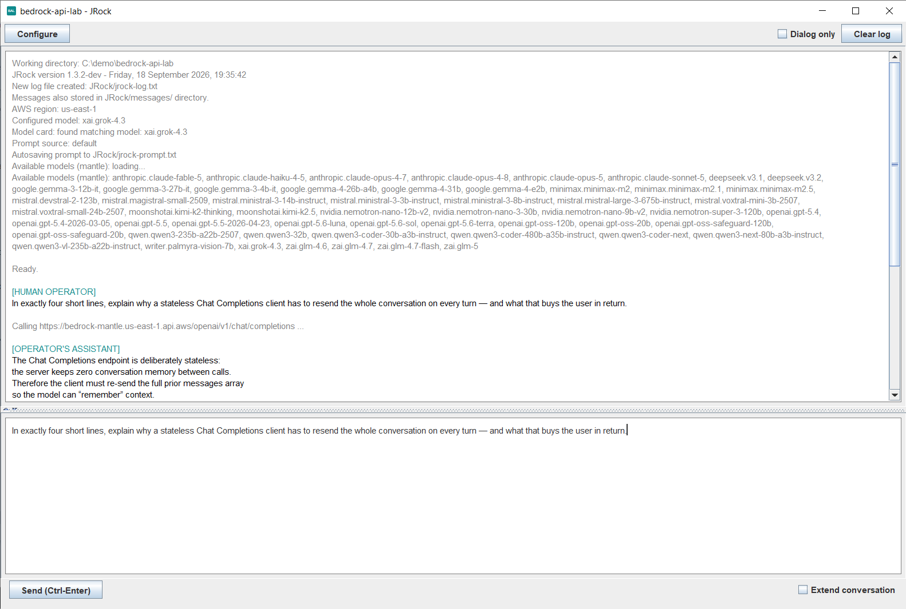
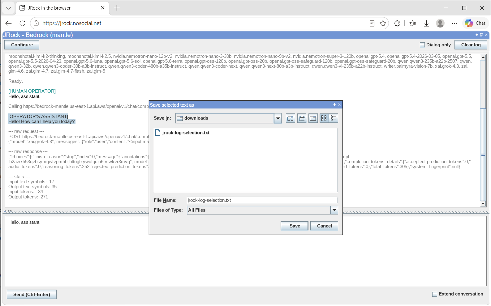
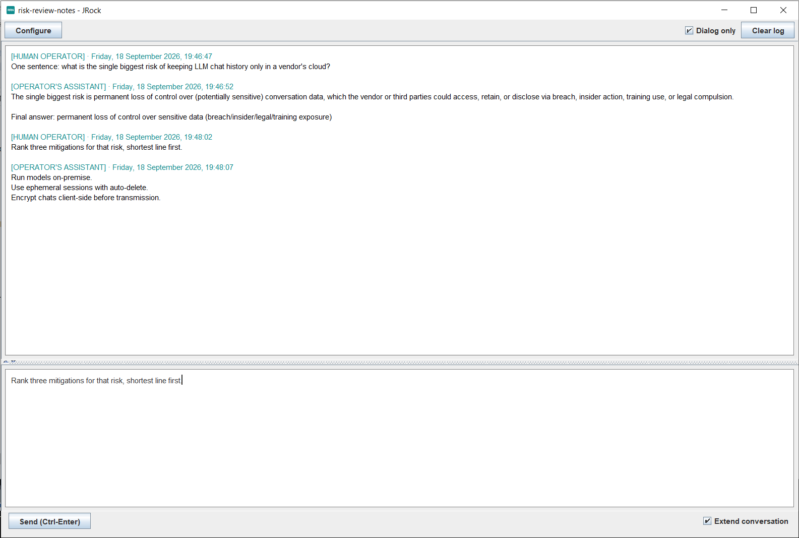
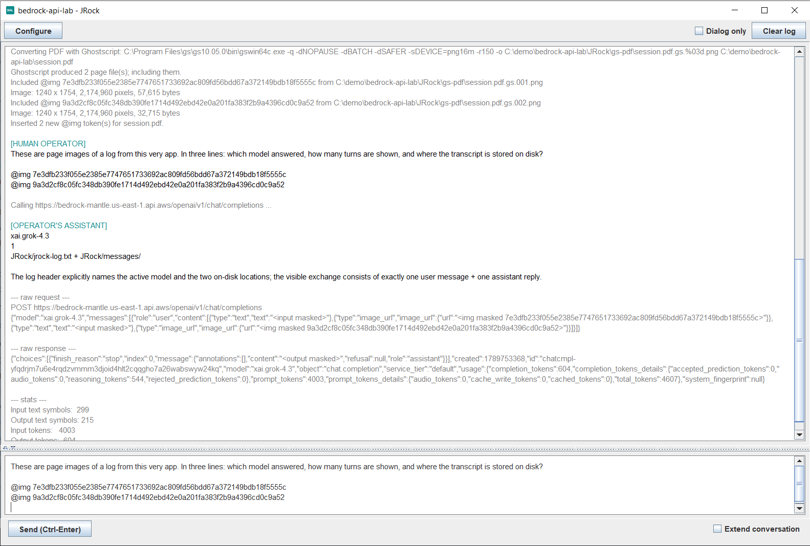
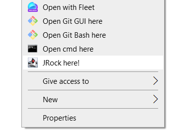

# JRock

A minimal, dependency-free Swing GUI desktop client (playground) for **Amazon Bedrock**,
built as a single Java source file. It calls the OpenAI-compatible **Chat Completions
API** on the **`bedrock-mantle`** endpoint using a lightweight **Bedrock API key**, and
keeps every prompt and conversation only on your local disk, as plain, visible files.

> The Amazon Bedrock desktop GUI playground in Java that just works: every prompt and 
> session is saved to disk so nothing is ever lost, and your credentials stay put with no
> repeated sign-ins, so it keeps out of your way and lets you focus on the models.



*A fresh session in `C:\demo\bedrock-api-lab`, which is also where the window title and its `BAL`
icon come from. Everything before the first prompt is JRock reporting what it configured and where
it put your files.*

By Ivan Khvostishkov, with assistance of Kiro and JetBrains IntelliJ IDEA.

---

## Highlights

- **Single file, zero dependencies.** Just `JRock.java`, no build tool, no jars, no AWS SDK.
- **Runs directly:** `java JRock.java`.
- **Bedrock API key auth** (Bearer token), no SigV4, no AWS SDK, no `~/.aws` credentials.
- **Everything local & transparent.** No server-side session state; all history lives in
  plain files under a `JRock/` folder you own and can inspect.
- **Crash-safe persistence** of the prompt and the full conversation.
- **Multimodal includes** (text and image files, plus PDF-to-text/PDF-to-images via
  Ghostscript) referenced by hash; multi-select supported.
- **Keyboard-driven**, with a Configure dialog for API key, region, model and working directory.

## Requirements

- **Minimum: JDK 11** — needed for single-file source launch (JEP 330) and
  `java.net.http.HttpClient`. On JDK 8-10 it won't run as a single file.
- **Maximum: none** — uses only core JDK APIs (`javax.swing`, `java.net.http`). Runs on
  the latest JDK.

## Getting started

1. **Get a Bedrock API key.** A short-term (recommended) key can be generated from the AWS
   console: https://console.aws.amazon.com/bedrock-mantle/api-keys
2. **Provide the key** either as an environment variable or via the in-app Configure dialog:

   ```powershell
   $env:BEDROCK_API_KEY = "..."
   $env:AWS_REGION = "us-east-1"   # optional; defaults to us-east-1
   ```

3. **Run it:**

   ```powershell
   java JRock.java
   # optionally load a prompt file on startup (read-only):
   java JRock.java path\to\prompt.txt
   ```

4. Type a prompt and press **Ctrl+Enter** (or the **Send** button).

## JRock Web (in the browser)

JRock also runs in your browser at **https://jrock.nosocial.net/** — no locally
installed JVM required. It loads the same unmodified `jrock.jar` and runs it entirely
**locally in your browser** via [CheerpJ](https://cheerpj.com/) (which executes JVM bytecode
as WebAssembly), so nothing runs on a server.

- **Real Bedrock calls work.** The browser has no socket layer, so JRock detects the browser
  runtime and sends its requests through the page's own `fetch()` instead — see
  [HTTP transport](#http-transport).
- **Entering your API key is safe here.** The page shows the jar's SHA-256 so you can confirm
  it matches the reproducible build before typing anything. The region and key stay in the
  page's JavaScript (`window.myBrowserHttp`): they are never passed to the in-browser JVM and
  never sent anywhere but the Bedrock endpoint. You can change the key at any time — a
  missing or rejected one reopens the credentials dialog by itself.
- **Right-click is a long tap.** On touch devices, press and hold to open the context menus.
- **Copy and paste reach other apps.** CheerpJ gives the JVM a clipboard of its own that
  nothing else can see, so JRock goes through the browser's clipboard instead: text moves
  between JRock and your mail or notes, by Ctrl+C/X/V or from the context menus. A browser
  may ask permission the first time a page reads the clipboard, and some refuse reads
  outright — paste then falls back to whatever was last copied inside JRock, and says so.



*The same jar in a browser tab — a Swing window, its own file chooser and all. Only the reply is
selected, so the context menu offers **Save selected text as...**; saving into `downloads` hands the
file to the browser as a download.*

## Endpoint & API design

- Uses the **`bedrock-mantle`** endpoint. AWS recommends `bedrock-runtime` for new apps
  (where Amazon Nova, Meta Llama and other families are also available), but as of
  Sep 2026 several frontier models run on `bedrock-mantle` only. JRock prefers mantle for
  the simplicity of a single API surface.
- Uses **Chat Completions**, not the Responses API. Responses is *stateful* (the backend
  retains conversation state). JRock deliberately avoids that: it stores **nothing** on the
  backend. All history stays local, unlike a browser client where session data can hide
  non-transparently in cookies / sessionStorage / IndexedDB. Chat Completions is stateless,
  so each request carries its own context.

## HTTP transport

JRock issues exactly two kinds of request (`GET /v1/models` and `POST /v1/chat/completions`).
Which transport carries them is decided once at startup and reported in the log:

| Runtime | Transport | Credentials |
|---|---|---|
| Any normal JVM | `java.net.http.HttpClient` | `BEDROCK_API_KEY` env var, or the Configure dialog |
| CheerpJ (browser) | the page's `window.myBrowserHttp.fetch` | held by the page; never passed to the JVM |

In the browser there is no socket layer, so `HttpClient` cannot work at all and the hosting page
provides the transport instead. Any host page can serve JRock by providing
`window.myBrowserHttp.fetch(url, options)` resolving to `{ status, body }`;
`jrock-web/index.html` is the reference implementation. It attaches the `Authorization` header
itself, so the API key never reaches the JVM, and it reports the region it holds a key for, which
JRock adopts at startup.

Credentials are deliberately **not** read from JVM system properties (`-Dname=value`): a key
passed on a command line leaks into shell history and process listings.

## Models

Known model "cards" record each model's modalities, supported APIs/endpoints, and the
correct mantle path (`/v1/...` vs `/openai/v1/...`). The **Model** field in Configure is
free-text with a dropdown pre-populated from the most recently fetched available models.

Model matching: exact model-id match wins; otherwise a **vendor-prefix** partial match
(e.g. any `anthropic.*` or `openai.*`); otherwise a default config is used. This is logged
at startup and after reconfiguration.

Built-in cards include:

| Model | Model ID | Chat Completions on mantle |
|---|---|---|
| Grok 4.3 | `xai.grok-4.3` | yes (`/openai/v1`) |
| Kimi K2.5 | `moonshotai.kimi-k2.5` | yes (`/v1`) |
| DeepSeek-V3.1 | `deepseek.v3.1` | yes (`/v1`) |
| Qwen3 32B | `qwen.qwen3-32b` | yes (`/v1`) |
| GPT-5.4 | `openai.gpt-5.4` | yes (`/openai/v1`) |
| GPT-6 Astra | `openai.gpt-6-astra` | yes (`/openai/v1`) |
| Claude Opus 5 | `anthropic.claude-opus-5` | no (Messages API only) |
| Claude Fable 5.1 | `anthropic.claude-fable-5-1` | no (Messages API only) |

> Anthropic Claude models are served on mantle via the Anthropic **Messages API**
> (`/anthropic/v1/messages`), not Chat Completions. JRock doesn't implement Messages yet,
> so selecting a Claude model reports this and doesn't send a (broken) request.

## Conversation log

- The transcript shows **branded role headers** (`[HUMAN OPERATOR]` / `[OPERATOR'S
  ASSISTANT]`) in a teal brand color, with the actual dialog text in black and all
  system/status output in gray.
- **Dialog only** mode (Ctrl+D) hides the gray system lines, leaving a clean, copy-pastable
  transcript.
- **Extend conversation** mode (Ctrl+E): each send includes the full prior dialog so the
  model sees a continuous conversation (stateless multi-turn). In this mode role headers are
  timestamped (e.g. `[OPERATOR'S ASSISTANT] · Monday, 14 September 2026, 10:01:34`) so the
  time order of stateless turns is visible.
- **Stats** per response: input/output text symbols, and input/output tokens (from the API's
  `usage`).
- The **raw request and raw response** are shown for debugging, but prompt/reply/attachment
  content is **masked** (shown by hash/placeholder) so the transcript isn't a noisy duplicate
  and included files stay referenced only by hash. The response `id` is elided after its
  first few characters (`"id":"chatcmpl-abcd<...>"`) — in full it is long enough on its own
  to put a horizontal scrollbar under the dump.



*Extend conversation (Ctrl+E) with Dialog only (Ctrl+D): the second question says "that risk" and
is answered correctly, because the whole prior dialog was resent. Every gray line is hidden, so
what's left is a clean, copy-pastable transcript — and the header timestamps keep the order of
these stateless turns visible.*

## Persistence (crash recovery + full local history)

Everything lives under a **`JRock/`** subfolder of the working directory:

- `JRock/jrock-prompt.txt` — the prompt, autosaved on every keystroke (atomic temp-file swap,
  so a crash can't corrupt it).
- `JRock/jrock-log.txt` — the conversation transcript, restored on startup so a session
  survives restarts.
- `JRock/messages/` — one **append-only** file per human/assistant message. These are never
  modified or deleted (not even by Clear log). `cat`-ing them in order reproduces the
  dialog-only transcript.
- `JRock/gs-pdf/` — per-page text/image files produced when a PDF is included via Ghostscript
  (see Multimodal includes).

The main log is a bit-perfect copy of the pane, except that each role header is followed by an
`@<datetime>` include-style reference to the message's own file under `JRock/messages/`.

**Clear log** empties `jrock-log.txt` and the window but never touches `JRock/messages/`, so
paid-for inputs/outputs are preserved. If the log has changed since it was last exported with
**Ctrl+L** (Save log as a copy), Clear log first asks for confirmation and suggests saving.

## Multimodal includes (Ctrl+I)

Attach **text or image** files to a prompt (and convert **PDFs** to either):

1. **Ctrl+I** opens a file picker. It's **multi-select**, so you can attach several files at
   once, and the dropdown offers four kinds:
   - **Image files** (png, jpg, jpeg, gif, webp)
   - **Text files** (txt, csv, html, java)
   - **PDF as text pages** — converts the PDF to one text file per page
   - **PDF as page images** — converts the PDF to one PNG per page
2. Each file is hashed (SHA-256, shortened to 12 hex digits). The hash → path mapping is kept **in memory only**
   (not persisted), so after a restart you must re-include files to reuse them.
3. A token `@img <hash>` or `@txt <hash>` is inserted at the cursor (one per file / per PDF
   page). Duplicate tokens for the same file are not added again (also checked across prior
   turns in Extend mode).
4. The log records each include with stats (locale-formatted numbers):
   - **Images**: dimensions, total pixel count, and file size in bytes.
   - **Text**: symbol count (Unicode code points) and file size in bytes.

### PDF conversion (Ghostscript)

Selecting a PDF filter runs **Ghostscript** to convert the PDF, one file per page, then
includes each produced page. Ghostscript must be on your PATH: `gswin64c` on Windows, `gs` on
macOS and Linux.

- Output is written under **`JRock/gs-pdf/`**, named `<pdfname>.gs.NNN.txt` (text pages via
  the `txtwrite` device) or `<pdfname>.gs.NNN.png` (page images at 150 dpi).
- The exact Ghostscript command and its output are echoed to the log.
- If Ghostscript isn't found on your PATH, JRock logs a note, shows a dialog, and opens
  https://ghostscript.com/ so you can install it. (Text extraction quality depends on the
  PDF; for an LLM, page-image includes are a reliable fallback for tricky PDFs.)



*A transcript printed to PDF with Ctrl+P and included straight back as page images: the exact
Ghostscript command, both pages with their dimensions and byte counts, and the `@img` hash tokens
still sitting in the prompt. The model then reads its own transcript and answers from the image
alone. Below it, the masked raw request and response, and the token stats.*

On send, every referenced include is verified (known hash **and** the file still hashes the
same, i.e. unchanged); on any problem the message is not sent and the reason is logged. Valid
includes are expanded into a **multi-part message**: text segments become text parts, `@img`
becomes a base64 image part, `@txt` becomes a text part with the file's contents. In Extend mode,
includes in prior turns are expanded too.

## Configure dialog (top-left button)

- **Working directory** (with a Browse button) — reroutes JRock's own files to the chosen
  folder. The OS-level process working directory is unchanged.
- **BEDROCK_API_KEY** — write-only: left blank, it keeps the current key; type a value to
  override for the session. The key is never displayed or stored beyond the running process.
  In the browser this row is absent: the key belongs to the page (see
  [HTTP transport](#http-transport)) and is changed there.
- **AWS_REGION** — free text.
- **Model** — free text with a dropdown of recently fetched models.

Applying re-runs the session init (working directory reported first, then models loaded,
ending with `Ready.`). Changing the working directory reloads the log from the new folder,
so nothing carries over from the old one.

The dialog also shows an **About** line with the version and a **JRock** link to the project
on GitHub, a short description, keyboard shortcuts, and authorship.

## Window move & resize (Ctrl+M)

A dialog to set the window **width/height** and **on-screen X/Y** numerically, plus info
about the screens (which monitor holds the window, each screen's bounds). Handy for precise
placement or moving across monitors without the mouse.

## Printing / PDF (Ctrl+P)

Opens the native print dialog for the log. On Windows you can pick "Microsoft Print to PDF"
to save the transcript to a PDF, or print to a physical printer. If text is selected in the
log pane, only the selection is printed (with its colors), so a single answer can be printed
without the surrounding transcript.

## Context menus (right-click / long tap)

Right-clicking (or long-tapping on touch devices) opens a context menu:

- **Log pane** — Save log copy as..., Print... When text is selected in the log, both act
  on the **selection only**, and the menu says so (*Save selected text as...*, *Print
  selected text...*). A partial export doesn't count as saving the log, so Clear log still
  warns about unsaved changes.
- **Prompt area** — Include text or image file... (also PDFs, multi-select), Load prompt from
  file..., Save prompt copy as...
- **Top bar (empty area)** — Move & resize window...; on **Windows**, also Install /
  Uninstall the "JRock here!" Explorer entry (see below).

## Windows: Explorer right-click integration

On Windows, the top-bar context menu (right-click the empty area of the top bar) offers
**Install "JRock here!" (Explorer menu)...** and **Uninstall "JRock here!" (Explorer
menu)...**. These items appear only on Windows. Installing adds two Explorer right-click
entries at once:

- **"JRock here!"** — on a folder's empty space or on a folder icon. Launches JRock in that
  folder, so its `JRock/` files (prompt, log, messages) are created right there. Explorer
  starts the process with its current directory set to the clicked folder, so no path
  argument is needed.
- **"Open as prompt with JRock"** — on a **`.txt`** file. Launches JRock with that file loaded
  as the initial (read-only) prompt. This adds a verb without changing the default open action
  for `.txt`.



*The installed entry, sitting with the other developer verbs and carrying JRock's own icon.
Clicking it starts JRock in that folder — no path argument, no console window.*

Details:

- **Per-user and reversible.** Entries are written under `HKEY_CURRENT_USER`, so no admin rights
  are needed, and Uninstall removes all of them.
- **No console window.** Both launch `javaw.exe`, so nothing flashes on screen.
- **Self-configuring.** They use the `javaw.exe` of the JVM currently running JRock, and launch
  JRock's own `jrock.jar` (or the `JRock.java` file when running from source) — no paths to edit.
- **Inspectable.** The applied registry file is kept under `JRock/`
  (`jrock-context-menu-install.reg` / `jrock-context-menu-uninstall.reg`), and each action is
  recorded in the log.
- On **Windows 11** the entries may appear under **"Show more options"**.

## Per-folder window title & icon

The window title and taskbar/Alt-Tab icon reflect the **working directory** so multiple JRock
windows opened in different folders are easy to tell apart:

- The title is `<folder> - JRock` (folder name first, so it stays visible even when Alt-Tab
  truncates the text).
- The app icon is a generated teal tile badged with a short abbreviation of the folder name
  (e.g. `my-cool-project` → `MCP`, `research` → `RES`).

In the browser this is switched off (plain title, plain `JR` icon): there's a single instance
and the directory is CheerpJ's own virtual mount, so naming it would say nothing useful.

## Keyboard shortcuts

| Shortcut | Action |
|---|---|
| Ctrl+Enter | Send |
| Ctrl+S | Save prompt as (a copy) |
| Ctrl+L | Save log as (a copy, or just the selected text) |
| Ctrl+O | Load prompt from a file (text only) |
| Ctrl+I | Include text/image files or a PDF (multi-select) |
| Ctrl+D | Toggle Dialog only |
| Ctrl+E | Toggle Extend conversation |
| Ctrl+M | Move & resize the window |
| Ctrl+P | Print log (or the selected text) / save as PDF |
| Ctrl+Z / Ctrl+Y | Undo / redo in the prompt |

## Reproducible builds

CI compiles `JRock.java` with a **pinned OpenJDK 11 patch (Temurin 11.0.32+9)** and repacks
the classes into a **byte-for-byte reproducible** `jrock.jar` (see `.github/build/BuildJar.java`).
The same source therefore yields the **same SHA-256 and MD5 on any machine or OS**.

For robustness the build runs on **three operating systems** and publishes three artifacts:

- `jrock-macos-latest.zip`
- `jrock-ubuntu-latest.zip`
- `jrock-windows-latest.zip`

Each archive contains the **same bit-perfect `jrock.jar`** plus its checksum files
(`jrock.jar.sha256`, `jrock.jar.md5`) and the zipped source (`jrock-src.zip`). Because the
build is reproducible, the `jrock.jar` inside all three archives is identical.

To verify and run JRock from a build artifact, unzip it, then:

```sh
cd jrock-ubuntu-latest/

sha256sum jrock.jar
md5sum jrock.jar

java -jar jrock.jar
```

Current build hashes:

```
dda9b7157818fa9e9919d12facfc378752f0e39bffa960370a3f1e25ebced036  jrock.jar
a7a0ce5db2379f2d780b9b9f6737ce42  jrock.jar
```

Or, if you want to modify the source and run it in place (no build step):

```sh
java JRock.java
```

## Tests

GUI tests live in **`tests/`** and run on **JUnit 5** with
[AssertJ-Swing](https://github.com/assertj/assertj-swing) (the maintained descendant of
FEST-Swing) driving the real widgets through `java.awt.Robot`. The test starts the actual
application via `JRock.main(...)`, finds its window, and waits for the log pane to report
`Ready.` among the rest of the session report.

```sh
cd tests/
mvn test
```

Nothing is stubbed and no credentials are needed: the test runs with `BEDROCK_API_KEY`
blank, so JRock skips its startup model-list fetch and never touches the network.

`JRock.java` is compiled **in place** from the repository root — the root keeps its single
Java file, and nothing is copied. Maven writes everything to `tests/target/`, which is
git-ignored, and that's also where the app's own `JRock/` folder goes during a test run.

CI runs this on every push (`.github/workflows/tests.yml`), under `xvfb` since the Linux
runners are headless, on JDK 11 — the minimum JRock supports.

Results are published to the **job summary** on the run's own page: how many tests passed,
each test's name, and for a failure the assertion text inline — rather than only in the raw
console log or the downloadable report zip. GitHub has no built-in JUnit view, so
`.github/build/TestSummary.java` renders Surefire's XML into Markdown. It uses nothing but
the JDK and needs no third-party action, the same reasoning as `BuildJar.java`; run it
locally with:

```sh
java .github/build/TestSummary.java tests/target/surefire-reports
```

## Notes

- All files created by the app are under `JRock/` and are git-ignored.
- File writes are atomic, so a crash or a failed write never leaves a truncated file.
