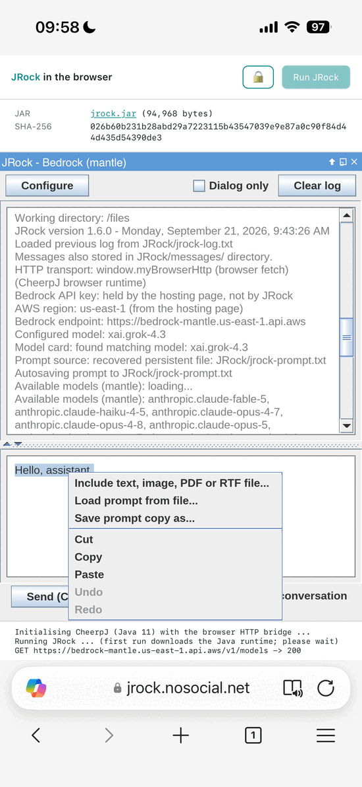

# JRock

A minimal, dependency-free Swing GUI desktop client (playground) for **Amazon Bedrock**,
built as a single Java source file. It calls the OpenAI-compatible **Chat Completions
API** on the **`bedrock-mantle`** endpoint using a lightweight **Bedrock API key**, and
keeps every prompt and conversation only on your local disk, as plain, visible files.

> The Amazon Bedrock desktop GUI playground in Java that just works: every prompt and 
> session is saved to disk so nothing is ever lost, and your credentials stay put with no
> repeated sign-ins, so it keeps out of your way and lets you focus on the models.


*A fresh session in `C:\demo\bedrock-api-lab`, which is also where the window title and its `BAL`
icon come from. Everything before the first prompt is JRock reporting what it configured and where
it put your files.*

By Ivan Khvostishkov, with assistance of Kiro and JetBrains IntelliJ IDEA.

---

## Highlights

- **Single file, zero dependencies.** Just `JRock.java`, no build tool, no jars, no AWS SDK.
- **Runs directly:** `java JRock.java`.
- **Bedrock API key auth** (Bearer token), no SigV4, no AWS SDK, no `~/.aws` credentials.
- **Everything local & transparent.** No server-side session state; all history lives in
  plain files under a `JRock/` folder you own and can inspect.
- **Crash-safe persistence** of the prompt and the full conversation.
- **Multimodal includes** (text, image and audio files, plus PDF-to-page-images via Ghostscript
  and RTF/DOCX-to-Markdown with no external tool at all) referenced by hash; multi-select
  supported, with optional **copies kept under `JRock/`** — downscaled to the page they will be
  read on, so no tokens are spent on pixels nobody sees — and every include **reloaded from the
  log** in one menu item after a restart
  ([**includes that outlive the session**](#includes-that-outlive-the-session)).
- **Merge two-sided (duplex) scans** — the two passes a sheet feeder produces, the fronts in
  order and the backs in reverse, interleaved into one PDF by the same Ghostscript
  ([**merging duplex scans**](#merging-duplex-scans-ghostscript)).
- **Fetch a URL** (Ctrl+U), not just a file: an address is downloaded into `JRock/urls/` and
  attached as text or as a picture according to the `Content-Type` it answered with, with a
  Markdown link to where it came from above the token ([**fetching a URL**](#fetching-a-url)).
- **Clock**: the local time and the full time zone (`Europe/Berlin`, not an offset) go with
  every message, so a model that is asked what day it is has an answer
  ([**Clock**](#clock)).
- **Backup and restore the whole working folder** as one `.zip` - by hand, or by itself after
  five minutes of not touching the prompt ([**backup and restore**](#backup-and-restore)).
- **Markdown export** of an answer as **RTF or DOCX**, written in-process — the model replies in
  Markdown, and a selected reply becomes a document a word processor, or a layout application,
  opens with its headings, tables and **the pictures it was given** intact
  ([**Markdown export**](#markdown-export-rtf-and-docx)).
- **A prompt library in plain files** — a folder of `.txt` prompts you can chain into a
  workflow, which is Bedrock Prompt management and Flows without the cloud
  ([`automation-samples/`](#prompt-library-and-chaining-automation-samples)) — and single-file
  **automations** that run such a chain by driving the real window, so you watch it
  work and carry on the conversation when it's done
  ([**automations**](#automating-the-chain-jrockdocinventoryjava)).
- **Keyboard-driven**, with a Configure dialog for API key, region, model and working directory.

## Requirements

- **Minimum: JDK 11** — needed for single-file source launch (JEP 330) and
  `java.net.http.HttpClient`. On JDK 8-10 it won't run as a single file.
- **Maximum: none** — uses only core JDK APIs (`javax.swing`, `java.net.http`). Runs on
  the latest JDK.

## Getting started

1. **Get a Bedrock API key.** A short-term (recommended) key can be generated from the AWS
   console: https://console.aws.amazon.com/bedrock-mantle/api-keys
2. **Provide the key** by typing it into the in-app **Configure dialog** (top-left button),
   which writes it to `JRock/bedrock-key.txt` in the working directory — or by putting it
   in that file yourself, one line and nothing else. Nothing is read from the environment;
   see [Settings files](#settings-files).

3. **Run it:**

   ```powershell
   java JRock.java
   # optionally load a prompt file on startup (read-only):
   java JRock.java path\to\prompt.txt
   # point Load/Save prompt (Ctrl+O / Ctrl+S) at a prompt library:
   java JRock.java --prompts-dir D:\prompts
   # ...and then name a prompt in it directly:
   java JRock.java --prompts-dir D:\prompts review.txt
   # work in a folder other than the one you launched from (see Agents):
   java JRock.java --working-dir D:\HPScan
   ```

4. Type a prompt and press **Ctrl+Enter** (or the **Send** button).

### The prompts directory

Prompts tend to live together in one folder, while the working directory is wherever
today's work is. The **prompts directory** separates the two:

- **Ctrl+O and Ctrl+S always open there.** Not "there the first time, then wherever you last
  browsed" — *every* time. A prompt library is a place you keep going back to, so a chooser
  that drifts adds a small navigation chore to every single load. If it's opening in the wrong
  place, that's a setting to change, not a folder to re-navigate.
- The **initial-prompt-file argument** is resolved relative to it, so it can be a bare file
  name. Absolute paths are unaffected.
- **Include (Ctrl+I)** and log exports are deliberately *not* affected — those files live
  wherever the source material is, so those choosers do remember where you last browsed.

Set it in the **Configure dialog** (its own row, under the working directory), or on the
command line with `--prompts-dir <dir>`. The dialog wins: changing it there replaces
whatever the flag asked for, for the rest of the session.

Unset, prompts simply **follow the working directory** — which is what a plain launch gets,
and what setting the prompts directory equal to the working directory means. That state isn't
a path frozen at launch: change the working directory later and prompts come with it.

On Windows, installing the **"JRock here!"** Explorer entries bakes in whichever prompts
directory is in effect at that moment — but only if it differs from the working directory,
since otherwise the flag would pin every future launch to today's folder. So the library
follows you into every folder; see
[Explorer right-click integration](#windows-explorer-right-click-integration).

For a ready-made one, point it at **`automation-samples/`** in this repository — three prompts,
two of which chain into a document-archiving workflow, and the two agents that run them, plus
a template for a library of your own. See
[Prompt library and chaining](#prompt-library-and-chaining-automation-samples).

`--prompts-dir=<dir>` works too, and the flag can come before or after the prompt file. The
directory is reported in the startup log whenever it isn't just the working directory —
including when the path isn't usable, in which case it's reported and ignored rather than
silently applied.

The **agents** — the `.java` automations that drive JRock through those prompts — live in the
same directory, which is why the Configure row is labelled **Prompts & agents** and why
**Install agent** browses it. See [Agents](#windows-agents-one-automation-per-folder).

### `--working-dir`

`--working-dir <dir>` (or `=<dir>`) names the folder JRock works in — its `JRock/` files, its
settings, its key — regardless of the directory the process was started in. A plain launch needs
it about as often as never: the working directory *is* where you launched from. What needs it is
an **agent**, because Explorer starts a right-click command in the folder that was clicked, and
an agent's whole point is to use one particular folder's settings on a file that may be anywhere
else. Reported in the startup log when it was given; a path that isn't a directory is reported
and ignored.

## JRock Web (in the browser)

JRock also runs in your browser at **https://jrock.nosocial.net/** — no locally
installed JVM required. It loads the same unmodified `jrock.jar` and runs it entirely
**locally in your browser** via [CheerpJ](https://cheerpj.com/) (which executes JVM bytecode
as WebAssembly), so nothing runs on a server.

- **Real Bedrock calls work.** The browser has no socket layer, so JRock detects the browser
  runtime and sends its requests through the page's own `fetch()` instead — see
  [HTTP transport](#http-transport).
- **The key goes where it goes on the desktop:** into JRock's own **Configure** dialog, which
  writes it to `JRock/bedrock-key.txt` — in the browser, inside CheerpJ's own persistent storage
  (`/files/`). So it is **still there after a reload**, it is changed in the one place anybody
  would look for it, and there is no JavaScript credentials dialog interrupting a send to ask
  for it again. The page shows the jar's SHA-256 so you can confirm it matches the reproducible
  build before typing anything, and the key never goes anywhere but the Bedrock endpoint. The
  region and model live beside it in `JRock/jrock-config.txt`, the same as everywhere else.
- **Right-click is a long tap.** On touch devices, press and hold to open the context menus.
- **The page gets out of the way — and comes back.** A few seconds after launch the page hides
  its own header and footer, giving the Swing display the whole tab. That is what the **Hide
  header and footer after launch** checkbox says it will do — ticked by default, and there so the
  disappearance is something you were told about rather than something that happened to you. It
  sits in the main area under the text about the checksum and the Configure dialog, with the note
  that brings them back, and not in the header: a label that long *was* the header on a phone.
  To check the checksum again, the top-bar context menu has **Show/hide the page header &
  footer**: it calls one function in the page, which flips the chrome and reports which way it
  went. The page owns that state, so JRock never has to guess.
- **Copy and paste reach other apps.** CheerpJ gives the JVM a clipboard of its own that
  nothing else can see, so JRock goes through the browser's clipboard instead: text moves
  between JRock and your mail or notes, by Ctrl+C/X/V or from the context menus. A browser
  may ask permission the first time a page reads the clipboard, and some refuse reads
  outright — paste then falls back to whatever was last copied inside JRock, and says so.
- **Image includes work too.** A browser JVM has no native libraries, so nothing here may
  depend on one — JRock reads an image's dimensions from its header rather than decoding it, and
  the downscale **Include with copy...** does is handed to the page, whose `canvas` decodes and
  re-encodes pictures in native code where CheerpJ's `ImageIO` and `Graphics2D` cannot (see
  [Multimodal includes](#multimodal-includes-ctrli)).
- **Fetch URL works too**, through the same page client as the Bedrock calls — one more method on
  `window.myBrowserHttp`, returning the bytes and the `Content-Type` so a picture stays a picture
  (see [fetching a URL](#fetching-a-url)). The browser's own rule applies: a site that does not
  allow cross-origin reads (**CORS**) cannot be fetched from a page, and is reported as refusing.


*The same jar in a browser tab — a Swing window, its own file chooser and all. Only the reply is
selected, so the context menu offers **Save selected text as...**; saving into `downloads` hands the
file to the browser as a download.*

## Mobile support for iOS and Android

Both work today, through [JRock Web](#jrock-web-in-the-browser): the phone's browser runs the same
unmodified `jrock.jar`, so there is nothing to install and no app store in the way.



*Edge on an iPhone, with the page's own header and footer left showing: the jar's size and SHA-256
to check before typing a key, and a footer log ending in `GET .../v1/models -> 200` — a real Bedrock
call from a phone. In the window, the session report (`/files`, the page's `fetch()` as the transport,
the key read from `/files/JRock/bedrock-key.txt`) and the prompt's context menu, opened with a long
tap because that is how a phone reaches everything the Ctrl shortcuts do.*

The UX is a little clumsy, and worth knowing about before you judge it:

- The on-screen keyboard sometimes needs a tap on the window **outside** the text area before it
  will come up. For a **masked** field it may not come up at all, which is why the
  [Configure dialog's](#configure-dialog-top-left-button) API key row is an ordinary field in the
  browser and carries its own **Paste** button — the one row a phone cannot type its way out of.
  Every other row there has a long-tap menu with Copy, Paste and Select all.
- Scroll bars, text selection and the menus are Swing's own, drawn for a desktop and driven by a
  fingertip. It takes some learning — but you do get used to it.
- **Several files in one include** need the file dialog's **File Name** box: a tap selects one
  file and there is no Shift to hold, so the names go in by hand, each in quotes —
  `"cat.png" "dog.png"`. That box has its own long-tap menu with Copy, Paste and Select all.

For an app like this that is a fair trade: one jar, one build, no per-platform code and no store
review, and the phone gets the same client as the desktop, with the same plain files under
`JRock/`.

### Working with PDFs

The PDF filter is the one thing a phone doesn't get, and so is the
[duplex merge](#merging-duplex-scans-ghostscript). Java ships no PDF support of its own, so
JRock converts with [Ghostscript](#pdf-conversion-ghostscript) as a subprocess — and there is no
process to start under a browser JVM, CheerpJ having no operating system beneath it. The filter is
still in the dropdown, and picking it there gets you the same "not found" note as a desktop without
Ghostscript installed. Two ways round, both of which work in a browser exactly as they do on the
desktop:

- **Page images.** Screenshot the pages in whatever PDF viewer the phone already has and include
  them under **Image files**. This is what *PDF as page images* produces anyway, done by hand — and
  image includes need nothing native, JRock reading their dimensions straight out of the file header.
- **Via a word processor's format.** Export the PDF as RTF or as Word in Acrobat (which has a mobile
  app too), then include the file as [**RTF as Markdown text**](#rtf-and-docx-conversion-no-external-tool) or
  [**DOCX as Markdown text**](#rtf-and-docx-conversion-no-external-tool) — or, for an `.rtf`, under
  **Text files as is**, markup and all. All of them run in-process on the JDK's own RTF reader and
  XML parser, so all of them work in a browser tab.

Which one depends on the document: a scan or anything where the layout carries meaning goes as page
images, while a text document is better via RTF or DOCX, where headings, bold, italic and — from a
`.docx` — tables survive into the Markdown as structure the model reads.

**And the other direction: making a PDF.** Select the answer in the log, long-tap (or right-click)
and pick **Export selected Markdown with images as DOCX...** — the Markdown becomes a real
document, headings and tables and all (and the photographs from the phone's camera roll, if they
were included with a [Markdown reference](#multimodal-includes-ctrli) and the model wrote it back),
under [named paragraph styles](#markdown-export-rtf-and-docx). Place that in
**InDesign**, which imports a Word file by mapping its style names onto your own paragraph styles,
and the PDF that comes out is typeset rather than printed from a text editor. **Export selected
Markdown as RTF...** is the lower standard for the same idea: no style names, but anything that
opens an RTF — Word, Pages, LibreOffice, TextEdit, WordPad — will read it. Neither is mobile-only:
the two items are in the log's context menu wherever JRock runs, and on the desktop they are the
short way from an answer to a document somebody else can edit.

### What native mobile support would take

The compilers already exist. For iOS,
[MobiVM/RoboVM](https://github.com/MobiVM/robovm) translates Java bytecode ahead of time into a
native iOS binary; for Android, the platform's own toolchain compiles Java straight to DEX and runs
it natively, Android having been a Java platform from the start. What is missing on both is
**Swing**: an AWT/Swing backend plugged into UIKit and Android's own view primitives, so that a
`JFrame` is a native window and a `JTextArea` a native text view with the keyboard, selection and
scrolling that the platform already knows how to do. That is a months-long project in its own right,
and none of it is specific to JRock.

**The two targets exist in this repository, and they fail on purpose.** [`android/`](android/) is a
minimal Gradle project that compiles the root `JRock.java` into an APK, and [`ios/`](ios/) is a
minimal MobiVM project that compiles the same file ahead of time into an iOS binary — one `Copy` task
each, pulling the single source file out of the repository root, which keeps its no-build-descriptor
rule intact. Neither one works: Android stops at `javac` on the first `javax.swing` import, and
MobiVM stops in the AOT compiler while linking. The
[Mobile builds (experimental)](.github/workflows/mobile.yml) workflow builds both — on
`ubuntu-latest` and on a `macos-latest` runner with Xcode — and is left red rather than hidden behind
`continue-on-error`, so the missing piece is a line in a log anybody can read instead of a claim in a
README. It is **manual**, run from the Actions tab: a job that is expected to fail would otherwise put
a red X on every commit and teach you to read past the two workflows whose colour means something.
The two directories' own READMEs list, in order of size, what replacing it would mean.

Which is also why it would be worth more than JRock. A Swing backend on native mobile primitives
would make plain Java a cross-platform UI target again — desktop, iOS and Android from one source —
and put Java and Swing back in the same row as Kotlin and Unity/C#. If that interests you, vote with
the **Sponsor** button at the top of this repository ;)

## Endpoint & API design

- Uses the **`bedrock-mantle`** endpoint. AWS recommends `bedrock-runtime` for new apps
  (where Amazon Nova, Meta Llama and other families are also available), but as of
  Sep 2026 several frontier models run on `bedrock-mantle` only. JRock prefers mantle for
  the simplicity of a single API surface.
  - What that costs us, concretely: `bedrock-runtime` has **`CountTokens`**
    (`POST /model/{modelId}/count-tokens` → `{"inputTokens": n}`), which prices a prompt
    *before* it is sent and is documented to match what the same input would be charged.
    Mantle has no such operation, and the Chat Completions schema has none either — token
    counts arrive only in a reply's `usage`, i.e. after paying for it. But not every model
    is on runtime (several of the cards below list no runtime APIs at all), so the count
    would be available for some models and not others — which is the same split that made
    mantle the choice in the first place.
- Uses **Chat Completions**, not the Responses API. Responses is *stateful* (the backend
  retains conversation state). JRock deliberately avoids that: it stores **nothing** on the
  backend. All history stays local, unlike a browser client where session data can hide
  non-transparently in cookies / sessionStorage / IndexedDB. Chat Completions is stateless,
  so each request carries its own context.

## HTTP transport

JRock issues two kinds of request to the model (`GET /v1/models` and
`POST /v1/chat/completions`), plus a plain `GET` of any address you give it with
[Fetch URL](#fetching-a-url). Which transport carries them is decided once at startup and
reported in the log:

| Runtime | Transport | Credentials |
|---|---|---|
| Any normal JVM | `java.net.http.HttpClient` | `JRock/bedrock-key.txt`, written by the Configure dialog |
| CheerpJ (browser) | the page's `window.myBrowserHttp` | the same file, in the browser's persistent storage |

In the browser there is no socket layer, so `HttpClient` cannot work at all and the hosting page
provides the transport instead. Any host page can serve JRock by providing two functions on
`window.myBrowserHttp`:

- **`fetch(url, options)`** resolving to `{ status, body }` — the model calls, whose bodies are
  JSON either way. The `options` include the headers JRock built, `Authorization` among them: the
  key is JRock's in the browser too, so one dialog sets it and one file keeps it.
  A page that would rather hold the key itself can attach that header instead and say
  `"credentials": "page"` in its `browserHttpInfo()` reply, which tells JRock to send none and
  never to report a missing one; the same reply can pin a `"region"`. `jrock-web/index.html`
  uses neither.
- **`fetchUrl(url, options)`** resolving to `{ status, contentType, url, bytes }` — an arbitrary
  address, for which a body of *text* would not do: Fetch URL decides between a page and a
  picture by the response's own `Content-Type`, and an image has to arrive as bytes
  (`Uint8Array`) to be saved at all. No credentials are attached to these.

`jrock-web/index.html` is the reference implementation of both.

Credentials are deliberately **not** read from JVM system properties (`-Dname=value`) or from
environment variables: a key passed on a command line leaks into shell history and process
listings, and an environment variable is set in a shell that's gone by the time anything goes
wrong. The key lives in a file you can look at instead — see [Settings files](#settings-files).

## Models

Known model "cards" record each model's modalities, supported APIs/endpoints, and the
correct mantle path (`/v1/...` vs `/openai/v1/...`). The **Model** field in Configure is
free-text with a dropdown pre-populated from the most recently fetched available models.

Model matching: exact model-id match wins; otherwise a **vendor-prefix** partial match
(e.g. any `anthropic.*`, `openai.*` or `google.*`); otherwise a default config is used. This is logged
at startup and after reconfiguration.

Built-in cards include:

| Model | Model ID | Chat Completions on mantle |
|---|---|---|
| Grok 4.3 | `xai.grok-4.3` | yes (`/openai/v1`) |
| Kimi K2.5 | `moonshotai.kimi-k2.5` | yes (`/v1`) |
| DeepSeek-V3.1 | `deepseek.v3.1` | yes (`/v1`) |
| Qwen3 32B | `qwen.qwen3-32b` | yes (`/v1`) |
| GPT-5.4 | `openai.gpt-5.4` | yes (`/openai/v1`) |
| GPT-6 Astra | `openai.gpt-6-astra` | yes (`/openai/v1`) |
| Gemma 4 26B-A4B | `google.gemma-4-26b-a4b` | yes (`/openai/v1`) |
| Gemma 4 E2B | `google.gemma-4-e2b` | yes (`/openai/v1`) |
| Claude Opus 5 | `anthropic.claude-opus-5` | no (Messages API only) |
| Claude Fable 5.1 | `anthropic.claude-fable-5-1` | no (Messages API only) |

> Anthropic Claude models are served on mantle via the Anthropic **Messages API**
> (`/anthropic/v1/messages`), not Chat Completions. JRock doesn't implement Messages yet,
> so selecting a Claude model reports this and doesn't send a (broken) request.

> **Gemma 4 E2B** is the one built-in card whose input modalities include **Audio**, which
> makes it the model to point an [`@audio` include](#what-an-audio-include-is-sent-as) at —
> its 26B-A4B sibling reads text, images and video and has a red cross in that row. Both are
> `bedrock-mantle`-only, both use the `/openai/v1` base rather than the default `/v1`, and both
> cap one request body at **3.5 MB** with attachments counted in, which a minute or two of wav
> reaches on its own. Their cards also note that Chat Completions returns no reasoning tokens
> even though these models reason — the reasoning happens, and is charged for, with nowhere in
> the API's response to put it.

## Conversation log

- The transcript shows **branded role headers** (`[HUMAN OPERATOR]` / `[OPERATOR'S
  ASSISTANT]`) in a teal brand color, with the actual dialog text in black and all
  system/status output in gray.
- **Dialog only** mode (Ctrl+D) hides the gray system lines, leaving a clean, copy-pastable
  transcript.
- **History** mode (Ctrl+E): each send includes the full prior dialog so the model sees a
  continuous conversation (stateless multi-turn). In this mode role headers are
  timestamped (e.g. `[OPERATOR'S ASSISTANT] · Monday, 14 September 2026, 10:01:34`) so the
  time order of stateless turns is visible.
- **Enter** — the checkbox beside the Send button, **off when JRock starts and never
  remembered**: when it is on, plain Enter sends as well as Ctrl+Enter. It earns its place
  twice over. Ticked, it is the fast way to talk; unticked, it answers in the one place you are
  already looking the question every new window raises — *what does Enter do here* — and the
  answer is "a new line, nothing else". It starts off, and stays off next time, so that answer
  never depends on a window that has already closed.
  **Shift+Enter is a new line whichever way the checkbox is set**, so one key always types one
  and never sends — which is what makes the checkbox safe to tick. It had to be bound
  explicitly: a Swing text area has no binding for Shift+Enter at all and Windows sends no
  typed character for it either, so until 2.1.0 it did nothing whatsoever. The newline is
  inserted directly rather than delegated to the editor kit's action, which is a look-up that
  can come back empty — and a key that silently does nothing is the one thing this checkbox
  exists to rule out.
- **Stats** per response: input/output text symbols, and input/output tokens (from the API's
  `usage`), followed by two lines of **rough cost** — a rule of thumb and this exchange priced
  by it:

  ```
  Rough price guide: $2-5 per 1M input tokens, $10-25 per 1M output (frontier average)
  Rough cost here:   in $0.002-0.006 + out $0.006-0.014 = $0.008-0.020, not this model's real price
  ```

  A band across the frontier models as a group, not the rate of whatever endpoint this build
  points at, and not a bill. It answers the question a long reply actually raises — cents or
  dollars — and it says out loud that it is a guide. Without `usage` counts the second line
  says so instead.
- The **raw request and raw response** are shown for debugging, but prompt/reply/attachment
  content is **masked** (shown by hash/placeholder) so the transcript isn't a noisy duplicate
  and included files stay referenced only by hash. The response `id` is elided after its
  first few characters (`"id":"chatcmpl-abcd<...>"`) — in full it is long enough on its own
  to put a horizontal scrollbar under the dump.
- Both headers **name the file that half of the exchange was written to** under
  [`JRock/messages/`](#persistence-crash-recovery--full-local-history), with the arrow the
  direction it went:

  ```
  --- raw request < 20260924-004543-348-operator.txt ---
  --- raw response > 20260924-004550-613-assistant.txt ---
  ```

  The dump is masked and those files are not, so this is one glance from the line in the log
  to the text it stands for, rather than a folder to be searched by the timestamp of a send. A
  send that failed wrote no reply file, and its response header stays bare.


*History (Ctrl+E) with Dialog only (Ctrl+D): the second question says "that risk" and
is answered correctly, because the whole prior dialog was resent. Every gray line is hidden, so
what's left is a clean, copy-pastable transcript — and the header timestamps keep the order of
these stateless turns visible.*

## Clock

**Clock** — the checkbox left of *History*, **on by default** — sends the current
local time with each message, as one extra `system` message ahead of the dialog:

```
<clock><now>2026-09-22 14:07:31 +02:00 Europe/Berlin</now></clock>
```

The zone is named in full (`Europe/Berlin`), not just offset: a model that knows the zone knows
about summer time, holidays and business hours, which an offset alone doesn't say. Without this
a model has no idea what day it is - the request carries no clock of its own.

It is **not** part of the conversation. It is never shown as a turn, never resent by *Extend
conversation*, and never read back from disk: what goes with the request is always the time
**now**, not the time some earlier message was sent. It is saved once, for debugging, as
`JRock/messages/<datetime>-clock.txt` beside the operator's and the assistant's own files, and
it appears verbatim (unmasked) in the raw request dump - the point of logging a clock being to
see what time was actually sent.

The clock goes with every request the checkbox is ticked for, whatever else that request carries
— text, images, a recording. Nothing is rearranged and nothing is switched off for you: if a
model turns out not to want a `system` message beside what you are sending it, untick Clock and
send again, which is one click in the same window.

## Persistence (crash recovery + full local history)

Everything lives under a **`JRock/`** subfolder of the working directory:

- `JRock/jrock-prompt.txt` — the prompt, autosaved on every keystroke (atomic temp-file swap,
  so a crash can't corrupt it).
- `JRock/jrock-log.txt` — the conversation transcript, restored on startup so a session
  survives restarts.
- `JRock/messages/` — one **append-only** file per human/assistant message
  (`<datetime>-operator.txt`, `<datetime>-assistant.txt`), plus a `<datetime>-clock.txt` for
  each clock that was sent (see [**Clock**](#clock)). These are never modified or deleted (not
  even by Clear log). `cat`-ing the operator's and the assistant's in order reproduces the
  dialog-only transcript.
- `JRock/bedrock-key.txt` and `JRock/jrock-config.txt` — the API key, and the region, model and
  images DPI (see [**Settings files**](#settings-files)).
- `JRock/gs-pdf/` — per-page text/image files produced when a PDF is included via Ghostscript
  (see Multimodal includes).
- `JRock/rtf-md/` — the Markdown produced when an RTF is included as Markdown text
  (see Multimodal includes).
- `JRock/docx-md/` — the same for a `.docx` included as Markdown text.

The main log is a bit-perfect copy of the pane, except that each role header is followed by an
`@<datetime>` include-style reference to the message's own file under `JRock/messages/`.

**Clear log** empties `jrock-log.txt` and the window but never touches `JRock/messages/`, so
paid-for inputs/outputs are preserved. If the log has changed since it was last exported with
**Ctrl+L** (Save log as a copy), Clear log first asks for confirmation and suggests saving.

## Settings files

**Nothing is read from the environment.** Settings are files in the working folder, next to that
folder's log and prompt — files you can open, edit, copy, back up and delete. An environment
variable is the opposite: set in a shell that's gone by the time anything goes wrong, invisible
from inside the running application, and different for every way of launching it.

- **`JRock/bedrock-key.txt`** — the Bedrock API key, on one line, and nothing else. Read at
  startup (trimmed of surrounding spaces) and written by the **Configure dialog** when you type
  a key into it. A folder that has none gets an **empty** file created, so there's an obvious
  place to put one; a key is never copied into a folder it wasn't typed for. It gets a file of
  its own because it's a credential: it can be locked down, kept out of a copy of the
  configuration, or deleted on its own.
- **`JRock/jrock-config.txt`** — the **region**, the **model** and the **images DPI**, so the
  next start comes up the way you left it. Seeded with the settings in effect when the folder
  has none. Per folder rather than per user on purpose: it is what lets one folder's
  [agent](#windows-agents-one-automation-per-folder) run on one model, and another folder's run
  on a different one — or at a different DPI. An `images-dpi$` that isn't one of the values the
  Configure dropdown offers is reported in the startup log and ignored, since that dropdown
  could only show it as something else and then write that back.

Both belong to the working folder, so they are adopted every time JRock takes a folder on:
startup, a change of working directory in Configure, a restore from a backup. In the browser both
files are the same files, kept in CheerpJ's persistent `/files/` — the key survives a reload
because it is on disk, not in a page's JavaScript. (A hosting page *may* hold the credentials and
name the region instead, and then what the page says wins; see
[HTTP transport](#http-transport).)

The config format is a name on one line and its **value on the next**:

```
' JRock settings - https://github.com/ivan-khvostishkov/jrock
'
' A setting is a name ending in $ on one line, its value on the next.
' Leading and trailing spaces are dropped. Blank lines, and lines starting
' with ' (a single quote), are ignored.

region$
us-east-1

model$
xai.grok-4.3

images-dpi$
150
```

A value being a whole line of its own is the whole point: it can be cut and pasted **as a line**
in any text editor, with no quoting, no escaping and no "everything after the `=`, but trimmed"
to get wrong. Lines starting with `'` are comments, and blank lines separate the pairs.

## Backup and restore

The whole working folder in one file, from the **top bar's context menu** (right-click the empty
area beside *Configure*):

- **Backup log...** asks for a `.zip` name - offering `jrock-backup-yymmddhhmm.zip`, in the same
  folder *Save log as* opens in - and packs the entire `JRock/` directory into it: the log, the
  prompt, every message file, the includes and everything the conversions wrote. The Send button
  is held while it runs, and the log says how many files and bytes went in.
- **Load from backup...** takes two paths: the archive (with a *Locate...* button) and the
  working directory to unpack it into (with a *Choose...* button). If that directory isn't
  empty it asks **Overwrite everything?** first. Then `JRock/` is deleted, the archive is
  unpacked in its place, and JRock **switches to that directory** - re-reading its log and its
  prompt exactly as it does when the working directory is changed in Configure.

An archive has to hold a `JRock/` folder or it is refused, which is what keeps *Load from
backup* from unpacking some unrelated zip over a working folder; nothing in it can be written
outside the chosen directory whatever the entry names say. A backup can't be saved inside
`JRock/` either - that is the folder being packed.

**Autobackup log** (Configure dialog, on by default) does the same thing by itself: five minutes
after the cursor last moved in the prompt, it takes a backup with the dated default name and no
dialog at all. Once per idle spell, not every five minutes - a window left open overnight has one
backup, and the next keystroke arms it again.

A backup is taken of a folder JRock is still writing to, and it is written to survive that. The
prompt is autosaved by writing a `jrock<digits>.tmp` beside it and moving it into place, so those
names appear and vanish in milliseconds; they are **not** packed — what one of them is about to
become is in the zip either as it was before the write or as it is after it. Any other file that
turns out to be gone or unreadable when its turn comes is skipped and counted, and the log says
so (`... file(s) were being written while the backup ran`) rather than the whole backup failing on
it. No lock is taken on the folder: JRock's own writes happen on the UI thread, so a lock held for
the length of a zip would stall typing rather than the write, an OS file lock means nothing to the
editor or sync client that may be in that folder too, and the browser build's filesystem has no
such lock to take.

## Merging duplex scans (Ghostscript)

**Right-click the empty area of the top bar → Merge two-sided (duplex) PDF scans...** — the first
item in that menu, alone above its separator.

A sheet feeder with no duplex unit takes a two-sided batch in two goes: the first pass gives the
fronts, in order, and then the stack goes back into the feeder exactly as it came out of it — so
the second pass gives the **backs in reverse**, the back of the last sheet first. Two PDFs, neither
of them readable on its own, and interleaving them by hand is a job nobody does twice. This is the
`pdftk A=front B=back shuffle A1 BN A2 B(N-1) ...` one-liner, done with the **Ghostscript** a PDF
include already needs — no pdftk, no Python, nothing else to install:

1. A **multi-select file chooser**, filtered to PDFs. Pick exactly **two** — both passes of the
   same batch, in any order. **Their names decide which is the front pass: the earlier name is
   the fronts**, so `scan0166.pdf` is the front of `scan0166.pdf` + `scan0167.pdf`, whichever was
   clicked first. On a touch device, both names in the File Name box in quotes selects two files
   without a Shift key ([context menus](#context-menus-right-click--long-tap)).

   The chooser's own order is not used, because it is not an order: `getSelectedFiles()` comes
   back in the order the selection happened or the File Name box was parsed, which varies by
   look-and-feel and by how the files were picked — `"doc.pdf" "doc-2.pdf"` typed in that box
   could arrive back to front, and the merge would then pair every front with the wrong back.
   Names are compared **without the extension** (a plain compare puts `doc-2.pdf` *before*
   `doc.pdf`, `-` being 0x2D and `.` 0x2E) and with **digit runs as numbers**, so `scan9.pdf`
   comes before `scan10.pdf` on a scanner that does not pad its counter. The log says which file
   it took as which before anything runs:

   ```
   Duplex merge, front pass (the earlier name): C:\scans\scan0166.pdf
   Duplex merge, back pass (in reverse): C:\scans\scan0167.pdf
   ```

   So a pair named `front.pdf` and `back.pdf` merges with **`back.pdf` as the front pass**:
   the names are read, not understood. Rename them if that is not what you meant.
2. A **save dialog** for the merged file, offering `<front-name>.Merged.pdf` in the folder you
   were just in — the front pass names it, its page 1 being the merged document's page 1.
3. Both passes are counted, and the merge runs: **front 1, back N, front 2, back N−1, …** — which
   is sheet 1 front, sheet 1 back, sheet 2 front, … because the second pass came out backwards.
   Ghostscript reads its arguments in order, so a `-dFirstPage`/`-dLastPage` pair in front of each
   named file picks one page out of it, and `pdfwrite` writes them in the order they are
   interpreted:

```
gswin64 -dNOPAUSE -dBATCH -dSAFER -sDEVICE=pdfwrite -o C:\scans\scan0166.Merged.pdf
        -dFirstPage=1 -dLastPage=1 scan0166.pdf  -dFirstPage=12 -dLastPage=12 scan0167.pdf
        -dFirstPage=2 -dLastPage=2 scan0166.pdf  -dFirstPage=11 -dLastPage=11 scan0167.pdf  ...
```

- **The page count comes first, and from the other Ghostscript.** The windowed build shows its
  progress in a window but writes nothing to a pipe, so the count is asked of the **console**
  build (`gswin64c`) instead: `runpdfbegin pdfpagecount`, a PostScript one-liner that reads the
  page tree and looks at no page at all. Ghostscript 10 replaced that interpreter, and there it
  fails — so the fallback is to interpret the file with no output device and read the number out
  of `Processing pages 1 through N.`, a line every version has printed for decades. That costs one
  pass over the document; the quick answer costs nothing.
- **The merge itself runs the windowed build** (`gswin64`, not `gswin64c`), which reports its
  progress in its own window and closes when it finishes — the log says so, since it has nothing
  to echo. The log line summarises the command rather than printing it: a full feeder names both
  files a few hundred times over.
- **A mismatch is refused, not merged.** Both passes feed the same sheets, so different page
  counts mean one of the two files is not the pass it was taken for — merging them would put the
  wrong back on every front. Picking one file, or the same file twice, or a merged name that is
  one of the scans, is refused the same way. Ghostscript is run from the folder the scans share,
  with bare file names, because every sheet names both files again and Windows stops accepting a
  command line at 32767 characters — past that the tool says so and suggests a shorter path or
  half the batch.
- **Nothing is deleted.** The shell one-liner this replaces ended in an `rm`; this ends in a line
  saying the two scans are untouched and to look through the merge before deleting them.
- Not in the [browser](#jrock-web-in-the-browser): there is no subprocess to start there, so the
  item answers with the same "Ghostscript not found" note as a desktop without it installed.

## Multimodal includes (Ctrl+I)

Attach **text, image or audio** files to a prompt (and convert **PDFs**, **RTFs** or **DOCX**
documents into either):

1. **Ctrl+I** opens a file picker. It's **multi-select**, so you can attach several files at
   once, and the dropdown offers seven kinds:
   - **Image files** (png, jpg, jpeg, gif, webp)
   - **Image with a Markdown reference** (the same files) — one line more in the prompt: a
     Markdown `` above the token. The model reads it as a picture belonging to the
     text and writes it back into its answer where the picture belongs, which is what
     [**Export selected Markdown with images as DOCX...**](#markdown-export-rtf-and-docx) then
     places
   - **Text files as is** (txt, csv, html, java, rtf) — sent exactly as they are on disk,
     RTF markup and all, for a model that reads (and writes) the format itself
   - **Audio files** (wav, mp3) — the recording itself, sent as an
     [`input_audio` part](#what-an-audio-include-is-sent-as) for a model that listens
   - **PDF as page images** — converts the PDF to one PNG per page
   - **RTF as Markdown text** — converts the RTF to one Markdown file
   - **DOCX as Markdown text** — the same for a Word `.docx`, tables included

   **Ctrl+Shift+I** (**Include with copy...** in the prompt's context menu) opens the very
   same dialog, with one difference: each chosen file is copied under `JRock/includes/` first
   and included from the copy ([why](#includes-that-outlive-the-session)) — and an image bigger
   than the page it will be read on is **downscaled as it is copied**, to the
   [**Images DPI**](#configure-dialog-top-left-button) the Configure dialog was left on.
2. Each file is hashed (SHA-256, shortened to 12 hex digits). The hash → path mapping is kept **in memory only**
   (not persisted), so after a restart the files have to be attached again — or their paths read
   back out of the log with **Reload all includes**
   ([below](#includes-that-outlive-the-session)).
3. A token `@img <hash>`, `@txt <hash>` or `@audio <hash>` is inserted at the cursor (one per
   file / per PDF page), preceded by a `` line under the Markdown-reference filter.
   Duplicate tokens for the same file are not added again (also checked across prior turns in
   Extend mode).
4. The log records each include with stats (locale-formatted numbers):
   - **Images**: dimensions, total pixel count, and file size in bytes.
   - **Text**: symbol count (Unicode code points) and file size in bytes.
   - **Audio**: what the header says — format, sample rate, channels, bitrate, playing time —
     and file size in bytes.

Image dimensions are read **straight out of the file header** — the PNG, GIF, WEBP and JPEG
headers all state the size in a documented place — rather than by decoding the image (an
`ImageHeader` class of its own, since byte-level format parsing has nothing to do with the
rest of JRock and is worth being able to read, and measure, on its own). That is
the same arithmetic on every platform, so the browser build reports the same numbers as the
desktop one; `ImageIO` could not, because in CheerpJ it reaches for the JDK's *native* colour
management (`UnsatisfiedLinkError: no lcms in java.library.path`) and an image include failed
outright over a line of log text. It is also less work: a 40 MB photo is no longer decoded in
full just to say how big it is. If a header can't be read, the include still happens and the
log says the dimensions were unavailable — the bytes sent to the model are the file itself
either way, so none of this touches what the model receives.

### What an audio include is sent as

An audio include is **not** an image: nothing is downscaled, nothing is converted, and there is
no Markdown-reference variant, because there is no picture to place in an answer. The bytes on
disk are base64-encoded and sent as an `input_audio` content part beside the text:

```json
{"type":"input_audio","input_audio":{"data":"UklGRiQ...","format":"wav"}}
```

**The parts go in the order your prompt wrote them**, part for part, recording included:

```json
{"role":"user","content":[
  {"type":"text","text":"transcribe me the audio"},
  {"type":"input_audio","input_audio":{"data":"UklGRiQ...","format":"wav"}}]}
```

Nothing is sorted for you — not images before text, not a recording before the question it
belongs to. A prompt's segments and the files between them only mean anything in the order they
were written, and where the token sits is the one place that order is visible, so it is the one
place it is decided.

That is worth knowing, because a model can care. Voxtral treats a recording as the prompt rather
than as something the prompt is about: say *"hello operator"* into it and it says hello back, and
a question typed in *front* of the audio gets answered as a question about nothing — *"I'd be
happy to help! Please provide the audio you'd like me to transcribe"*, with the recording sitting
right there in the same message, counted in `prompt_tokens` and all. Its
[own examples](https://huggingface.co/mistralai/Voxtral-Mini-3B-2507) put the audio chunk first in
every one. The fix is a prompt, not a feature: put the `@audio` token first, or send the
recording with no text at all. Another model may want the opposite, which is exactly why JRock
does not choose.

The `format` is the file's own extension, lower-cased, and **wav and mp3 are the only two there
are**: [the API's schema](https://github.com/openai/openai-openapi) makes that field an enum of
exactly those. `m4a` was in the filter for one version — it is what a phone's voice memo hands
back, nothing documented it either way, and the endpoint was the only authority worth asking. It
was asked, it refuses, and the filter no longer offers a file the request cannot carry. (`m4a`
*is* documented for the separate *transcription* endpoint, which JRock does not call; and
Voxtral's `input_audio` has no format field at all, decoding with libsndfile, which has no AAC.)

A path handed straight to `automationInclude` can still be anything, so one that is neither wav
nor mp3 is called out where it was picked rather than left to come back as an HTTP 400:

```
This would go out as input_audio with format "m4a", which the API does not take: the field is an enum of "wav" and "mp3", and an m4a comes back refused. Convert the file to one of those two first.
```

What the log reports is read **straight out of the header**, by an `AudioHeader` class that is
`ImageHeader`'s counterpart and exists for the same reasons: arithmetic on the first few
kilobytes, no decoder, no native library, nothing that behaves differently in the browser build
(the byte-order helpers are literally `ImageHeader`'s — a nested class can reach a sibling's
private statics). Both formats say enough to be worth reading:

| Format | Read from | Example log line |
|---|---|---|
| **WAV** | the RIFF chunks, walked for `fmt ` and `data` — so the playing time is exact | `Audio: WAV, 44.1 kHz, stereo, 16-bit, 1,411 kbps, 0:32, 5,644,844 bytes` |
| **MP3** | the first frame header after any ID3v2 tag; the playing time follows from the file size at that bitrate, which is why it says *at that bitrate* | `Audio: MP3 (MPEG 1 Layer III), 44.1 kHz, stereo, 128 kbps, 1:15 at that bitrate, 1,207,296 bytes` |

Anything else — including an MPEG-4 file that reached the include some other way — reports
*(nothing readable in the header)* and its byte count, which is the honest answer and is what
the file is charged by anyway. That is the deal the class is kept to: **a hundred lines** of
arithmetic and not one more, so when a format wants more than that (a VBR header for an exact
MP3 length, an MP4 box walk for a duration) the answer is the byte count, not a decoder inside
JRock. An `ftyp` box is recognised for one reason only — to stop the MP3 frame scan mistaking a
box for a frame sync and inventing a line about a file it cannot read.

Everything else is the machinery the other kinds already use: the same hash, the same
deduplication, the same re-check of every file on send, the same **Reload all includes**. One
place differs: the [masked request dump](#conversation-log) prints `<audio masked <hash>>` where
the base64 would be, for the same reason images are masked — a minute of audio is about a
megabyte of it.

One thing to know before sending, though: the [**Clock**](#clock) is a `system` message, and a
model that listens may refuse one beside a recording. A send with both warns and then goes as it
is; unticking **Clock** is the fix, and it is yours to make.

**Fetch URL** does not download audio; audio comes from Ctrl+I.

### Fetching a URL

The same include, for something that isn't on this machine. **Ctrl+U**, or **right-click the
prompt → Fetch URL...**, asks for an address, downloads it into `JRock/urls/`, and includes the saved
file exactly as if you had picked it with Ctrl+I — a **web page as text**, an **image as a
picture**. Two lines go into the prompt, the address above the token:

```
[](https://example.org/a/article)
@txt 1f3a9c0b7e42
```

The link says where the text or the picture came from, in a form the model reads as a
reference belonging to the content below it; the token is what is actually sent.

**The dialog is sized against the screen.** A text field asks for room for its columns and an
HTML label asks for room for its longest line, and both of those were written for a desktop
window — so on a phone the dialog came out wider than the screen, which puts its **OK** button
past the edge. The explanation now wraps to a width taken from the screen and the field asks for
fewer columns in the browser, where the layout stretches it anyway. In the browser the URL row
also carries a **Paste** button of its own, exactly like the [Bedrock API
key](#configure-dialog-top-left-button) row: an address is pasted rather than typed, and a button
is one tap that no browser gesture can take away.

What decides which of the two it is — and the extension the file is saved under — is the
**response's own `Content-Type`**, not the URL. A link ending in `.png` that answers with HTML
is a web page, and saving it as a PNG would only produce an `@img` token no model can read:

| It answers with | Saved as | Inserted as |
|---|---|---|
| `text/html`, `application/xhtml+xml` | `.html` | `@txt` — sent as text, markup and all |
| `image/png` | `.png` | `@img` — sent as a picture |
| `image/jpeg` | `.jpg` | `@img` |
| `image/gif` | `.gif` | `@img` |
| `image/webp` | `.webp` | `@img` |
| **anything else** | — | **nothing.** The type is named, in the log and in a dialog, and no file is written |

Details:

- **The file is named after the URL**, by its last path segment, with the extension its media
  type calls for *added* rather than substituted — `/a/article` → `article.html`,
  `/pics/cat.png` → `cat.png`, `/page.php` → `page.php.html`, and an address with no path of
  its own → `<host>.html`. Anything a file system might object to becomes `-`, and a very long
  name is cut. The same URL fetched twice is **one file** (same bytes, same name, nothing
  rewritten); a different page that wants a taken name becomes `article-2.html`, exactly as an
  [include copy](#includes-that-outlive-the-session) does.
- **A page is saved as UTF-8**, decoded first with the charset the response declares — an
  included text file is *read back* as UTF-8, so a page served as `windows-1251` would
  otherwise reach the model as mojibake. An image is saved byte for byte: those bytes are what
  gets sent.
- **`https://` is assumed** when the address has no scheme, so a bare `example.org/page` works;
  anything else keeps the scheme it was given, and one that is not `http` or `https` is
  refused by name. Redirects are followed (but not an `https` → `http` downgrade), and the
  address the bytes really came from is logged when it differs.
- Because the file lands under `JRock/`, it is **already where the copies go** — a URL include
  survives a restart the same way, with **Reload all includes**.
- **In the browser it goes through the page**, `window.myBrowserHttp.fetchUrl` — the same
  arrangement as the model calls, one more method on the same object, so both builds run the
  identical code above this line. The reply carries the status, the `Content-Type`, the address
  finally landed on and the bytes themselves, which is everything the rules above need. The one
  difference is the browser's, not JRock's: a page it fetches must allow cross-origin reads
  (**CORS**), and most sites do not. A site that refuses is named as such, and the dialog says so
  before you try.

### Includes that outlive the session

The hash → path map is not persisted, and a restart therefore loses it — while the prompt and
the whole transcript *are* restored from disk. So the tokens come back and nothing knows what
they stand for: sending says `Included @img <hash> is not known`, and the conversation is stuck
until every file is attached again. Two things fix that, and they are meant to be used together.

**Include with copy...** — a second item in the prompt's context menu, **Ctrl+Shift+I**, right
under the plain include. It opens the same dialog, with the same six filters and the same
multi-select, and does one thing more: a chosen file is **copied into `JRock/includes/` first and
included from the copy**, so the log's line points inside the folder you own:

```
Copied for the include: C:\photos\IMG_4002.jpg -> C:\demo\JRock\includes\IMG_4002.jpg
Included @img 1f3a9c0b7e42 from C:\demo\JRock\includes\IMG_4002.jpg
```

A menu item rather than a checkbox in the chooser, because a chooser has nowhere of its own to
put one: the only slot it offers is the accessory, a column down the right-hand side that takes
its width off the file list — on a narrow dialog about a third of it, for one checkbox, with the
rest of the column empty. Two different files of the same name both survive, the second as
`IMG_4002-2.jpg`; the same file twice is not copied twice. A file already under
`JRock/includes/` is included where it is, and so is anything the conversions wrote (they write
under `JRock/` themselves). A copy that fails is reported and the original included anyway —
the item is there to keep a file within reach, not to refuse the include. It matters most in
the [browser](#jrock-web-in-the-browser), where an uploaded file lands in CheerpJ's `/uploads`
and is gone after a reload, taking the only path the log recorded with it.

**And a copy is JRock's own file, so an oversized image is downscaled into it.** The page a
picture is read on is A4 less 2 cm margins — the [DOCX export's](#images-in-the-docx) text
frame — which at the [**Images DPI**](#configure-dialog-top-left-button) in Configure has room
for a definite number of dots each way: 1004 × 1518 at the default 150. A phone photograph or a
600 dpi scan carries several times that, and the extra pixels are paid for twice, once in tokens
and once in the time spent sending them, without anybody ever seeing them. So the copy is scaled
to fit, and says its new size in its name:

```
Downscaled for the include: 4032 x 3024 -> 1004 x 753, which is what A4 at 150 dpi has room for.
Copied for the include: C:\photos\IMG_4002.jpg -> C:\demo\JRock\includes\IMG_4002-1004x753.jpg
```

One factor for both directions, so whichever of width and height binds, the picture keeps its
proportions; the reduction is done by repeated halving, because a single bilinear step reads four
pixels out of the dozens each new pixel covers and turns small print into aliased crumbs. JPEGs
are written back at quality 0.92 rather than ImageIO's default 0.75, legibility being the whole
reason for keeping the pixels that are kept. **PNG and JPEG only**: a GIF may be an animation
(ImageIO would hand back its first frame) and the JDK cannot read WEBP at all, so both are copied
at full size with a line saying why. A picture already within the page is copied byte for byte,
and a plain include is never rewritten — that file is not JRock's. The page here is A4 **portrait**
even though the [export](#markdown-export-rtf-and-docx) can also write landscape: a copy is made
long before anybody picks an orientation in a save dialog, and portrait is the frame that is enough
for either — cut to it, a picture is placed at 300 dpi on a landscape page rather than stretched to
fill it.

**In the browser the page scales it.** CheerpJ's JVM has no image pipeline to do this with:
`ImageIO.read` on a JPEG goes looking for the native colour-management library it cannot load,
and its `Graphics2D` resamples nothing — so the log used to promise a downscale and the copy
came out at full size. A browser, on the other hand, decodes, resamples and encodes PNG and
JPEG in native code as a matter of course, so JRock hands the picture to the page over the
[bridge](#http-transport) and gets it back smaller: `canvas`, the same repeated halving, the
same 0.92 for JPEG. A page without that function (an older `jrock-web`) means a full-size copy
and a line saying so, the same as any other scaling that could not be done.

**Reload all includes** — an item in the prompt's context menu, which rebuilds the map from the
log. The log recorded every include ever made, which is the same information the map held, so it
is read top to bottom as the history it is:

| In the log | What it means |
|---|---|
| `Included @img <hash> from <path>` (or `@txt`, or `@audio`) | remember `<hash>` → `<path>`, replacing an earlier path for that hash — the file was included again, perhaps from somewhere else |
| a message (yours or the model's) referring to a hash | that hash is wanted, at the path remembered for it **at that point**, so a later include cannot rewrite what an earlier message meant |

Both spellings of a reference count: the `@img`/`@txt`/`@audio` token, and the `` a
[Markdown-reference include](#multimodal-includes-ctrli) leaves — an answer carrying one needs
the file to export as a DOCX with the picture in it. The current prompt is read last, being the
newest thing there is, and after a restart its recovered tokens are usually the whole reason for
doing this. Each hash is then reported on its own line:

```
Reloaded @img 1f3a9c0b7e42 from C:\demo\JRock\includes\IMG_4002.jpg
Reloaded @txt 8b52e0ad91cc from C:\demo\JRock\rtf-md\quarterly.rtf.md - but that file is not there any more.
No include recorded for @img 4d0c1a77e6b3 - attach the file again with Ctrl+I (the log may have been cleared since).
Reload all includes: 1 reloaded, 1 with a missing file, 1 not recorded in the log (of 3 referred to). Each file is checked again, by its hash, on send.
```

**Nothing is hashed here**, deliberately. Whether each file is still the file it was is exactly
what the send checks, one hash per token, and the answer can change between the two moments
anyway — so a reload is cheap on a folder of large attachments, and a file that has been edited
since is caught at the only moment that matters. What the reload *does* check is that the file is
still there, because a path that no longer exists is the one problem you can do something about
before sending.

### PDF conversion (Ghostscript)

Selecting the PDF filter runs **Ghostscript** to convert the PDF, one page image per page, then
includes each produced page. Ghostscript must be on your PATH: `gswin64` on Windows, `gs` on
macOS and Linux.

**Page images and nothing else.** There was a *PDF as text pages* filter, on Ghostscript's
`txtwrite` device, and it is gone: `txtwrite` takes the text operators as they come and hands
back something a model has to guess at — no headings, no tables, columns interleaved. A PDF whose
text matters is better turned into RTF or DOCX in Acrobat and included under
[**RTF as Markdown text** or **DOCX as Markdown
text**](#rtf-and-docx-conversion-no-external-tool), where the structure survives as structure.
A scan has no text layer to extract in the first place, and goes as page images.

A long conversion says so while it runs, rather than after. The command line is logged before
Ghostscript is started, and the conversion happens off the UI thread so the window stays
alive. On **Windows** JRock runs the **windowed** build (`gswin64.exe`, preferring it over
`gswin64c.exe`), which reports its progress in its own window and closes when finished.
Everywhere else the console `gs` is run with `-q` omitted, and its progress — `Page 1`,
`Page 2`, … — is echoed into the log as `gs:` lines while it works.

- Output is written under **`JRock/gs-pdf/`**, named `<pdfname>.gs.NNN.png` — page images at
  the **Images DPI** set in Configure (150 by default), the page's physical size being the
  PDF's own business.
- The exact Ghostscript command and its output are echoed to the log.
- If Ghostscript isn't found on your PATH, JRock logs a note, shows a dialog, and opens
  https://ghostscript.com/ so you can install it.


*A transcript printed to PDF with Ctrl+P and included straight back as page images: the exact
Ghostscript command, both pages with their dimensions and byte counts, and the `@img` hash tokens
still sitting in the prompt. The model then reads its own transcript and answers from the image
alone. Below it, the masked raw request and response, and the token stats.*

### RTF and DOCX conversion (no external tool)

Selecting **RTF as Markdown text** or **DOCX as Markdown text** converts the document to
Markdown and includes *that* file as an ordinary `@txt` token — so what the model receives is a
text part, and the prompt shows one token for the document.

Nothing has to be installed, unlike the PDF path. The RTF reader is the JDK's own
`javax.swing.text.rtf.RTFEditorKit`, the same one a `JTextPane` uses; a `.docx` is a ZIP of XML,
so it is read with `java.util.zip` and the JDK's XML parser. Both work on a bare JVM — and in a
browser tab, where no subprocess can run at all. Markdown rather than flat text because the
formatting is what these formats are for: headings, bold, italic and (from a `.docx`) tables
survive as markup a model reads as structure instead of being thrown away.

**From an RTF.**

- Output is written under **`JRock/rtf-md/`**, named `<rtfname>.md` — `notes.rtf` becomes
  `notes.rtf.md`, so two RTFs with the same stem can't overwrite each other.
- What is mapped, and nothing more:

  | In the RTF | In the Markdown |
  |---|---|
  | paragraph | a block, separated by a blank line |
  | bold, italic | `**bold**`, `*italic*`, `***both***` |
  | a font size larger than the document's body size | a heading — `#`/`##`/`###` by how much larger (6 pt, 3 pt, any), short lines only |
  | a bullet character (Word writes the bullet as text) | a `-` list item; `1.`, `2)` … are kept as they are |

  Markdown's own characters in the text (`*`, `` ` ``, `\`, a leading `#`) are escaped, so a
  document that talks about asterisks still says so.
- **Not** attempted: tables (RTF table rows reach the reader as ordinary paragraphs, so their
  cells run together), embedded images, colours, alignment. Underline has no Markdown of its
  own and stays plain text rather than being invented into emphasis.
- A file that isn't really RTF (some other document renamed, say) has no text the reader can
  find; JRock logs that and includes nothing, rather than attaching an empty file.

**From a `.docx`.** A Word document says what each paragraph *is* — a style name, a list
reference, a table cell — so the conversion reads that structure rather than guessing at it from
font sizes:

- Output is written under **`JRock/docx-md/`**, named `<docxname>.md` — `quarterly.docx` becomes
  `quarterly.docx.md`, the same rule as for RTF.
- Only `word/document.xml` is read, and only these parts of it:

  | In the document | In the Markdown |
  |---|---|
  | a `Heading1`…`Heading6` or `heading 1`… style (either spelling), or `Title` | `#` … `######` |
  | a paragraph with `w:numPr` (list markup) | a `-` list item — Word keeps the bullet in the numbering, not in the text |
  | a `Quote`-ish style | a `>` quote line |
  | a `Code`/`Preformatted`/`Listing`/`Source` style | an indented code block |
  | `w:b`, `w:i` on a run (`w:val="false"` switches it back off) | `**bold**`, `*italic*`, `***both***` |
  | `w:tbl` | a pipe table, with a `\| --- \|` separator after the first row; a `\|` inside a cell is escaped |
  | `w:tab`, `w:br`, `w:cr` in a run | a space; a `w:noBreakHyphen` a `-` |
  | runs Word split mid-word | one word — adjacent runs with the same bold/italic are joined back together |
  | a `w:hyperlink` | its text, in place; the URL lives in a part this does not read |

  Markdown's own characters in the text are escaped here too, so a document about asterisks
  still says so.
- **Not** read: `numbering.xml` (so every list level is a `-`, and numbered lists are not
  renumbered), headers, footers and footnotes, embedded images, colours, alignment and
  underline (which has no Markdown of its own, same as on the RTF side). With track changes on,
  an insertion is read as the text it is and a **deletion is not read at all** — `w:delText` is
  text someone took out, not text the document says.
- A file that isn't really a `.docx` — an older `.doc`, a PDF, anything renamed — has no
  `word/document.xml`, and the log says exactly that: *Could not read DOCX renamed.docx: no
  word/document.xml inside it - is it really a Word .docx?* Nothing is included and no
  `JRock/docx-md/` is created.

On send, every referenced include is verified (known hash **and** the file still hashes the
same, i.e. unchanged); on any problem the message is not sent and the reason is logged. Valid
includes are expanded into a **multi-part message**: text segments become text parts, `@img`
becomes a base64 image part, `@txt` becomes a text part with the file's contents, `@audio`
becomes a base64 [`input_audio` part](#what-an-audio-include-is-sent-as). In Extend mode,
includes in prior turns are expanded too.

## Prompt library and chaining (`automation-samples/`)

Bedrock has a managed answer to reusable prompts:
[Prompt management](https://docs.aws.amazon.com/bedrock/latest/userguide/prompt-management.html)
stores prompts as AWS resources with *variables*, *variants* and immutable *versions*, edited in
a console *prompt builder*; [Flows](https://docs.aws.amazon.com/bedrock/latest/userguide/flows.html)
chains them by wiring one node's output into another's input, then publishes a version, points
an *alias* at it, and runs it with `InvokeFlow`.

JRock does the same thing with **plain text files in a folder you own**. A prompt is a `.txt`
file; the library is a directory ([the prompts directory](#the-prompts-directory)); a variable
is an [`@txt` / `@img` include token](#multimodal-includes-ctrli); and chaining is you —
**Ctrl+L** the part of the reply you want, **Ctrl+I** it into the next prompt.

| Bedrock | JRock |
|---|---|
| Prompt, stored as an AWS resource in one region | a `.txt` file in your prompts directory |
| Variable, filled in at invoke time | an `@txt` / `@img` token, filled in by Ctrl+I |
| Version / variant (immutable snapshot) | a file copy — or whatever your version control already does |
| Prompt builder in the console | the prompt pane, and any text editor |
| Flow: prompt nodes wired output → input, version + alias, `InvokeFlow` | Ctrl+L the output, Ctrl+I it into the next prompt |
| IAM permissions, service quotas, per-node billing | files |

Nothing to deploy, nothing to keep in sync with a region, and the whole workflow is
greppable. By hand it is two keystrokes between the steps — which is also where you get to read
the intermediate result before it becomes the next prompt's input. When you'd rather not be
there for it, a chain can also run itself: see
[Automating the chain](#automating-the-chain-jrockdocinventoryjava).

### The samples

`automation-samples/` holds three prompts — two that chain and one that stands alone — the two
agents that run them, and doubles as a template for a prompts directory of your own:

- **`jrock-prompt-doc-to-ascii.txt`** — turn a document into plain text that keeps its layout:
  ASCII rules for tables, right-aligned text kept right-aligned to a fixed column, centred text
  centred, one separator line per page. Written for a scanned or printed PDF, included as page
  images.
- **`jrock-prompt-doc-inventory.txt`** — read a document and answer with **nothing but a file
  name**, following one convention:
  `<date>-<counterparty>-<what it is>-<document number>`, e.g.
  `2026-06-14-DHL-FollowUpOnParcelDelivery-1234567890`. Titles and counterparties are
  normalised to English and Latin-1 and shortened to the name people actually use
  (*Beitragsservice* → `GEZ`, *Bayerische Landesbank* → `BayernLB`).
- **`jrock-prompt-translate-to-english.txt`** — translate a document into English and answer
  with **nothing but the translation**, after one `Translated from: <language>` line. All of it,
  not a summary; the original's paragraphs, headings, lists, tables and page separators kept;
  numbers, dates, amounts, reference numbers, addresses and URLs copied rather than
  reformatted; names transliterated with the original in parentheses the first time, and terms
  with no English equivalent given the same treatment (*income tax return
  (Einkommensteuererklaerung)*). What cannot be read becomes `[unreadable]` instead of a guess,
  and what can — a stamp, a signature, a handwritten note — is translated and marked as such.

All three end in bare `@img` / `@txt` lines. Those are **placeholders, not tokens** — a real
include token carries a 12-hex-digit hash, so a bare one is only ever sent as the text it is.
They mark where the attachments belong: put the cursor on that line and press Ctrl+I.

### The scenario: a PDF you can find again

The point of chaining these two is an archive whose file names mean something, plus a text copy
of every document for reading and further automation.

1. **Ctrl+O** → `jrock-prompt-doc-to-ascii.txt`.
2. **Ctrl+I** → the PDF, with the **PDF as page images** filter. Ghostscript rasterises it, one
   PNG per page, and each page's `@img` token lands in the prompt. Page images because layout is
   the whole question here, and a scan has no text layer at all.
3. **Ctrl+Enter**. The reply is the document as plain text.
4. **Select that reply in the log and press Ctrl+L** — with a selection, Ctrl+L saves *just the
   selection* ("Save selected text as"), so you get the document and not the transcript around
   it. Save it next to the PDF.
5. **Ctrl+O** → `jrock-prompt-doc-inventory.txt`. Ctrl+O always opens back in the prompts
   directory, so step 5 is the same two keystrokes as step 1 even though step 4 just saved a
   file somewhere else entirely.
6. **Ctrl+I** → the `.txt` you just saved, with the **Text files as is** filter. One `@txt` token.
7. **Ctrl+Enter**. The reply is a base file name.
8. **Rename both files to it** — `<name>.pdf` and `<name>.txt`.

The result is a PDF you can identify from the file listing alone, and a text twin of it that
`grep` can read. Repeat per document; the prompts don't change.

### Using them

Point JRock's prompts directory at the folder — `--prompts-dir` on the command line, or the
**Prompts directory** row in [Configure](#configure-dialog-top-left-button) — and all three
prompts are two keystrokes away from any working directory. On Windows, installing the
["JRock here!" entries](#windows-explorer-right-click-integration) with it set bakes it in, so
the library follows you into whichever folder you right-click.

They are worth reading before they're worth running: the useful part is not the wording but
the shape — one prompt per step, the step's input left as an include token at the bottom, and
an output narrow enough to be the next step's input. Copy the folder and rewrite the contents
for your own documents. The `jrock-prompt-*.txt` names are only a convention, matching the
`jrock-prompt.txt` autosave and the `jrock-prompt-copy.txt` that Ctrl+S offers; JRock loads any
text file.

### Automating the chain (`JRockDocInventory.java`)

The eight steps above are a loop you run per document, and the third file in
`automation-samples/` runs them for you. It is one Java file, started the way JRock is:

```
java -cp jrock.jar JRockDocInventory.java document.pdf   # no argument: it asks for the file
java -cp jrock.jar JRockDocInventory.java document.rtf   # an RTF works as well as a PDF
java -cp jrock.jar JRockDocInventory.java --working-dir D:\HPScan   # that folder's settings
```

It reads the same two prompts out of its own directory, sends the document, saves the reply as
`document.txt` beside it, sends *that* with the inventory prompt, and offers to rename the files
to the name that comes back. Then a "Finished" dialog, and the window is yours.

**A PDF or an RTF**, and the difference is what the model is shown: a PDF goes in as one page
image per page, an RTF as [Markdown](#rtf-and-docx-conversion-no-external-tool) — text, which
is a fraction of the price of the same page photographed, and says exactly what is on it rather
than something to be deciphered. The chooser offers both extensions; a path from the right-click
menu is *checked* to be one of them, because that menu hands over whatever was clicked, and a
.jpg converted, sent and charged for before anyone notices is a poor way to find out.

**A PDF and an RTF of the same name are one document filed twice** — which is exactly what
Acrobat's *Export to RTF* leaves behind. So the pair is followed in both directions: pick either
and the other is found beside it, and picking the PDF gets an offer to read the RTF instead
(*"Both files are renamed either way"*). The rename at the end moves **two files or three** — the
scan, its text export and the plain text this run wrote — all to the same name, together or not
at all. Half a document renamed is the mess this automation exists to clear up, not to make.

File names in its dialogs each get **a line of their own**, indented, never sharing a line with
prose: `2026-06-14-DHL-FollowUpOnParcelDelivery-1234567890.pdf` is an ordinary name here, and
three of those wrapped into a paragraph is a dialog as wide as the desktop with nothing to
compare down a column.

The name is **found** in that reply rather than assumed to be all of it: the prompt asks for
nothing but the name, and a model that adds a sentence about the document anyway should not have
that sentence turned into a file name. So the reply is searched for the line that looks like one
— name characters and little else, few enough spaces to be a name rather than prose — and failing
that, for a name embedded in a line (`File name: 2020-07-27-FTS-3NDFL-TaxReturn-2019`). The first
line that answers wins, the top of a reply being where the answer was asked for. If nothing in
the reply looks like a file name, the automation stops and shows you the reply, instead of
renaming your documents to a sentence.

"Name characters" means **letters, not ASCII**: `2026-09-22-MünchnerBank-…` stays that way. The
prompt asks for Latin-1, which has umlauts and an eszet in it, and held to `A-Za-z0-9` the
sanitiser turned every letter it did not know into a dash — `2026-09-22-M-nchnerBank-…`, where a
dash is exactly the character that means *the next part of the name starts*. So the test is
Unicode's own (`\p{L}`), and the reply is normalised to NFC first, so an *ü* is one character and
not a *u* with a combining mark trailing it — the two look identical on screen and only one is
what the file system and the person searching the folder next year will agree on.

JRock's flags are passed straight through, and the document is not — a bare argument is a prompt
file to JRock, so the two are told apart on the way in. That is what
[**Install agent**](#windows-agents-one-automation-per-folder) installs: one right-click command
with `--working-dir` and no document (so the chooser asks, in that folder), one with the clicked
file appended.

**Copy `jrock.jar` into `automation-samples/` first.** Nothing downloads it: take it from a
[reproducible build](#reproducible-builds) artifact, or build it with
`java .github/build/BuildJar.java`, and put it next to the script. That copy is what enables
automations, and it is deliberately a manual act — an automation directory is a jar, some
prompts and the scripts that chain them, all files you put there yourself. The jar is in
`.gitignore` and the build tool skips `.jar` files in that directory, so a local copy changes
nothing about the repository or the reproducible source zip.

`-cp jrock.jar` is not optional, and it does more than you'd think: the
[source-file launcher](https://openjdk.org/jeps/330) compiles the script **in memory against
that class path**, so the script's `JRock.automationSend(...)` calls are ordinary typed static
calls the compiler has checked — and no reflection is involved anywhere. Forget the flag and you
get `cannot find symbol: variable JRock` before anything runs (source-file mode compiles *only*
that one file, so it won't quietly pick up a `JRock.java` sitting next door either); use a jar
too old to have the automation API and the error names the missing method. Both are better
diagnoses than any dialog would be.

What it does *not* do is run headless. It starts the real window and drives it, so:

- the prompt fills with include tokens page by page as Ghostscript rasterises the PDF, and the
  log reports every step, exactly as if you were typing;
- **the prompt is read-only while the automation runs** — a keystroke landing in a prompt that
  is about to be sent is the one failure mode here that would be silent, so the field is locked,
  Send is held, and both are released at the end;
- **History is forced off** for the duration (and restored afterwards), so pass two
  asks about a text file and not about pass one's page images all over again;
- both turns stay in the transcript, and when the dialog closes the prompt is editable and the
  conversation is there to be continued by hand — asking the model *about* the document it just
  read is usually the next thing you want.

It fails by saying why, in the log and in one dialog: no Bedrock key, initialisation that never
finished, no Ghostscript (so nothing was included, which is a stop rather than a request that
asks about a document and attaches none of it), a reply that never came back. Nothing is
overwritten — an existing `document.txt` becomes `document-2.txt`, and the same on rename.

### A second agent: translating (`JRockTranslateToEnglish.java`)

One pass instead of two, and the shorter half of why both samples are here:

```
java -cp jrock.jar JRockTranslateToEnglish.java Rechnung.pdf
java -cp jrock.jar JRockTranslateToEnglish.java --working-dir D:\HPScan   # it asks which file
```

It loads `jrock-prompt-translate-to-english.txt`, includes the document, sends, and writes the
reply beside the original as **`<name>-en.txt`** (`-en-2.txt` if that one exists — nothing is
overwritten, and nothing existing is touched at all, so unlike the inventory it has no question
to ask and runs straight through). The summary names the language the model says it translated
from, read back off that first line.

**The document can be any kind JRock can include**, and the include kind comes from the
extension: `.pdf` as page images, `.docx` and `.rtf` converted to Markdown text, `.txt` `.md`
`.csv` `.html` `.log` `.java` as they are, and `.png` `.jpg` `.jpeg` `.gif` `.webp` as pictures.
Which is what makes this one worth [installing as an
agent](#windows-agents-one-automation-per-folder): that right-click entry hands over whatever
file you clicked, of any type, so a scan, a Word document and a photograph of a page all
translate from the same menu item. An extension it has no include for is a stop naming the ones
that work — before the window opens, not after a minute of Ghostscript.

The `.txt` next to the original is an archive copy, not the only place the answer is. The
translation is in the transcript, which is the point of driving the real window: select it there
and **Export selected Markdown with images as DOCX...** turns it into a document, in
[either A4 orientation](#markdown-export-rtf-and-docx) — a translated letter usually wants to
end up as a letter.

Its one real limit is that a reply is one reply: a very long document can run into the model's
own output limit, and what comes back then is a translation that stops in the middle rather than
an error. JRock sends no `max_tokens` of its own, on purpose — any number it guessed would
truncate some model's useful output — so the ceiling is whatever the chosen model applies. Split
the document, or choose a model with more room.

The two files are also worth reading side by side. The plumbing — the flags, `ownDirectory()`,
`check()`, `reply()`, the dialogs on the event dispatch thread — is the same twice, because an
automation *is* a prompt, an include and a send; what differs is the chain around them. Copy
whichever is closer to yours.

### The automation API

`JRock.java` exposes the handful of `public static` methods the script uses. They take and
return nothing but `String`, `String[]`, `long` and `int`, and a `null` return means *fine* —
anything else is a sentence saying what went wrong, in the language the log is written in, so a
script can put it straight into its own dialog without a table of error codes in between.

Static because there is nothing to instantiate: the window, the log, the `JRock/` directory and
the Bedrock session are one per process, so there is no object that could hold a second set of
them. `JRock.main(new String[0])` shows the window and returns; the methods below drive the one
that is there, and every one of them **blocks and must not be called on the event dispatch
thread** — they say so rather than deadlocking if you do.

| Method | What it does |
|---|---|
| `automationAwaitReady(long millis)` | Blocks until the window is up and the model list is in. Returns why not — including the missing API key. |
| `automationBegin(String what)` | Takes the window: prompt read-only, Send held, Extend off, and a log line saying so. Refuses if an automation is already running. |
| `automationLoadPrompt(String file)` | Ctrl+O, from a path. |
| `automationDropPlaceholders()` | Removes the bare `@img` / `@txt` / `@audio` placeholder lines, and returns how many. The include tokens go at the end of the prompt. |
| `automationInclude(String file, String kind)` | Ctrl+I, from a path: `"pdf"` (page images), `"img"`, `"imgref"`, `"txt"`, `"audio"`, `"rtf"`, `"docx"`. Fails when nothing was included. |
| `automationSend(long millis)` | Ctrl+Enter, and waits for the answer. Returns `{ok, operator stamp, assistant stamp, why not}`. |
| `automationMessageFile(String role, String stamp)` | The path of one `JRock/messages/` file, or `null` when it isn't there. |
| `automationWindow()` | The `JFrame`, so an automation's own dialogs belong to it. |
| `automationEnd(String note)` | Gives the window back: prompt editable, Send released, and a log line saying so. |

The "reference" a send returns is a pair of timestamps, because a timestamp already *is* the
name of the file the message was written to (see
[Persistence](#persistence-crash-recovery--full-local-history)).
So an automation reads the answer out of `JRock/messages/<stamp>-assistant.txt` — the same file
you would open yourself — after checking that the request's own file is there, which is what
makes the pair trustworthy. No new state, no separate transcript, nothing an automation can see
that you cannot.

## Configure dialog (top-left button)

- **Working directory** (with a Browse button) — reroutes JRock's own files to the chosen
  folder. The OS-level process working directory is unchanged.
- **Prompts & agents** (with a Browse button) — where Ctrl+O, Ctrl+S and **Install agent** open,
  always (see [the prompts directory](#the-prompts-directory)). It shows the path actually in effect, so
  on a plain launch it shows the working directory; set it back to that to have prompts follow
  the working directory again. Leaving the row untouched changes nothing, so moving the
  working directory alone doesn't pin prompts to the folder you just left. A directory that
  doesn't exist yet is created.
- **Bedrock API key** — write-only: left blank, it keeps the current key; type or paste a value
  to replace it. What you enter is **trimmed** and written to `JRock/bedrock-key.txt` in the
  working directory, which is where it's read from at startup — trimmed because a pasted key
  arrives with whatever the page copied around it, and no Bedrock key has a space or a newline
  in it. The key is never displayed. The row disappears only when the hosting page holds the
  credentials itself (see [HTTP transport](#http-transport)): then there is no key of JRock's to
  change.
  In the browser the row is a **plain, unmasked field with its own Paste button**. The mask is
  what a phone's CheerpJ build will not raise a keyboard for — the region field beside it, same
  dialog, does come up — and a row you cannot fill in is worse than one whose text can be read
  over your shoulder; the button then works whatever the keyboard does, since a key is pasted
  and never typed from memory. Its menu is **Paste** alone: a key that goes in does not need to
  come back out.
- **Region** — free text. Kept in `JRock/jrock-config.txt`, so it survives a restart.
- **Model** — free text with a dropdown of recently fetched models. Kept in
  `JRock/jrock-config.txt` too — as is the **Images DPI** below, which is what makes one
  folder's [agent](#windows-agents-one-automation-per-folder) a different agent from the same
  automation installed from another folder.
- **Images DPI** — how fine a picture JRock keeps, per inch of page: 72 / 96 (screen), **150**
  (documents, the default), 203 (fax/receipt), 300 (print). The image is what the model actually
  sees, so this is a real trade-off — too low and small print is unreadable, too high and you pay
  tokens for detail no model needs. One number for two jobs, because it is the same question asked
  twice: a PDF included as page images is rasterised at it (Ghostscript's `-r`, the page's
  physical size being the PDF's own business), and an image included with
  [**Include with copy...**](#includes-that-outlive-the-session) is downscaled to it, measured
  against A4 less 2 cm margins. Only reported at startup when it isn't the default; every PDF
  conversion logs its full Ghostscript command line regardless, and every downscale says what it
  did.
- **Autobackup log** — on a line of its own (it shared the DPI row until 2.1.0, which made
  two unrelated settings read as one), and **on by default**: after five
  minutes without the cursor moving in the prompt, the whole `JRock/` folder is zipped into
  `jrock-backup-yymmddhhmm.zip` in the working directory, with the Send button held for as
  long as it takes (see [**backup and restore**](#backup-and-restore)). Reported at startup
  only when it is **off**, so nobody counts on a backup that isn't being taken.

Every row above has a **right-click — or, on a touch screen, a long-press — menu** with Copy,
Paste and Select all (the model's is on the combo's editor, which is what a tap lands on). On a
phone there is no Ctrl+V, and *Select all* is in there because a field that already holds a
region, a model or a path is a field whose contents are in the way of the one being pasted over
it. The API key row is the exception, with Paste alone.

The long press is timed **from the press and checked again on release**, not left to the timer
alone. A `javax.swing.Timer` fires on the event queue, and a modal dialog runs that queue in a
nested loop of its own — in the browser runtime the timer behind it may simply never come up,
which is why the menu did nothing in exactly the two dialogs that needed it, this one and
[Fetch URL](#fetching-a-url). Mouse events do arrive there (the field takes the tap and the
keyboard appears), so the clock is read from them instead of trusted to fire. On the desktop
nothing changes: a right-click is still a right-click.

Applying re-runs the session init (working directory reported first, then models loaded,
ending with `Ready.`). Changing the working directory reloads **both the log and the prompt**
from the new folder, so nothing carries over from the old one. A folder with no prompt of its
own keeps the one on screen and stores it there.

The dialog is titled **Configure JRock** and opens with two lines of its own: the version, with
a **JRock** link to the project on GitHub and a **Help** button at the far end of the same line;
then, below it, who wrote it — Ivan Khvostishkov, with assistance of Kiro, Claude and JetBrains
IntelliJ IDEA.

### Help (the button on the first line)

What JRock is, where to write about it — **jrock@nosocial.net** — the whole **Shortcuts** list
and the **Notes** on what every setting does and which file keeps it. All of it in one scrolling
window that opens *on top of* Configure, so anything already typed into the form is still there
when it closes.

It was in the Configure dialog itself until 2.1.0, above and below the rows it describes: three
screens of prose in front of someone who opened the dialog to change the model, and no easier to
find for being in the way. The window is sized against the screen, like the Fetch URL dialog
below, so on a phone it is a short window that scrolls rather than a tall one with its button
off the bottom.

## Window move & resize (Ctrl+M)

A dialog to set the window **width/height** and **on-screen X/Y** numerically, plus info
about the screens (which monitor holds the window, each screen's bounds). Handy for precise
placement or moving across monitors without the mouse.

## Printing / PDF (Ctrl+P)

Opens the native print dialog for the log. On Windows you can pick "Microsoft Print to PDF"
to save the transcript to a PDF, or print to a physical printer. If text is selected in the
log pane, only the selection is printed (with its colors), so a single answer can be printed
without the surrounding transcript.

## Markdown export (RTF and DOCX)

The model answers in Markdown. Select an answer in the log, right-click, and two more items
write that answer out as a document: **Export selected Markdown as RTF...** and **Export
selected Markdown with images as DOCX...**. Both are greyed out without a selection — there is
nothing to export but a selection — and a save dialog gives the file the right extension whatever
you type into it. Not mobile-only, and not desktop-only: it is the same code in a browser tab,
because both converters are built in and neither starts a process.

- **RTF** is written by hand as plain ASCII: every character above it becomes a `\u` control
  word, so no encoding anywhere can change what the file says. Swing's `RTFEditorKit` reads the
  import direction but does *not* write this one — its writer has no notion of a table, and a
  table is half of what a document is for.
- **DOCX** is a five-part OOXML package (`[Content_Types].xml`, two `_rels`, `word/styles.xml`,
  `word/document.xml`) zipped with `java.util.zip`, plus one `word/media/` part per picture it
  places. The paragraphs carry **named styles** — Normal, Heading 1–6, Code, Quote — and the page
  is A4 with 2 cm margins, which is why this is the format to export for typesetting: a layout
  application imports a document by mapping style *names* onto its own.
- **Which A4** is the DOCX save dialog's file-type dropdown: **DOCX document as A4 portrait** or
  **as A4 landscape**. Same extension either way, so what you type is unaffected; the orientation
  is a property of the document, and the save dialog is the last moment anybody is asked anything.
  Landscape is worth having for a wide table or a landscape photograph, both of which are laid out
  to fit the text frame — and on a portrait page that frame is the narrow way round. The log line
  says which one it wrote.

What the Markdown becomes, in both:

| In the Markdown | In the document |
|---|---|
| `#` … `######` | Heading 1–6, sized 18 pt down to 11 pt |
| `**bold**`, `*italic*`, `` `code` `` | bold, italic, a monospace run |
| `-`/`*`/`+` and `1.`/`1)` items, indented | a list paragraph, bullet or its own number, nested up to five levels |
| `> quoted` | an indented italic paragraph — the *Quote* style in the DOCX, so a bold run inside it stays bold-italic |
| a fenced block (three backticks or tildes) | a Code paragraph, verbatim |
| `---`, `***`, `___` | a horizontal rule |
| `\| a \| table \|` with a `\| --- \|` row | a real table: bordered cells, columns shared across the page width, first row repeated as a header, and `:---:` / `---:` honoured as cell alignment |
| `[text](url)` | the text, with the URL after it unless the two say the same thing — paper cannot be clicked |
| `\*` and the rest of Markdown's escapes | the character itself |

An export **does not fail**. The parser's answer to anything it doesn't recognise is "a
paragraph of text"; if it throws anyway, the document is rebuilt as one paragraph per line and
the log says so — *the text is all there, the formatting is not*. The log line reports what was
written: the file, the block and table counts, and the byte count.

A `.docx` written here reads back through **DOCX as Markdown text** as the same Markdown, give
or take the two honest differences a round trip has: a table's header row was written bold, so
it comes back as bold markup, and column alignment is layout the import doesn't read.

### Images in the DOCX

The DOCX export is the one that carries pictures, which is what *with images* in its name means.
It works on the two things an include leaves in the text, and the model repeats in its answer:

| In the Markdown | In the DOCX |
|---|---|
| `` of an **included** image | the picture itself, zipped into the package as a `word/media/` part and placed as an inline drawing |
| `@img <hash>` of an **included** image | the file's **base name**, `IMG_4002.jpg`, as text — the token named a file, and the document says which |
| either one, for a hash **not included** in this session | the line exactly as it stands, plus a warning in the log |

**Nothing about an image stops an export.** A hash whose file was never included — a restart
forgets the includes, and the model can invent a hash as easily as a word — is left in the text
as the text it is, and the log says which hash and why once, however many times it occurs. The
same goes for an include that is not an image at all (a `@txt` file the model referenced as a
picture) or a file whose bytes are not a PNG, JPEG, GIF or WEBP: the reference stays, the export
finishes. The log line counts the pictures it did place along with the blocks and tables.

**Sizes are physical, and resolution is the limit.** The page is A4 with 2 cm margins, so the
text frame is 17 × 25.7 cm portrait and 25.7 × 17 cm landscape, and an image is placed as large as
it can be without falling below **300 dpi** in either direction:

- A picture big enough in pixels fills the text frame — the width for a landscape one, the height
  for a portrait one, whichever runs out first. **Both frame dimensions come from the orientation
  the export was asked for**, so a landscape picture on a landscape page is placed against the
  25.7 cm width rather than against the 17 cm of a page it isn't on. A table's columns are shared
  out of the same frame, and the section states the page both ways a reader might read it: the two
  dimensions swapped, and `w:orient="landscape"`.
- A picture too small for that is placed at exactly 300 dpi instead, so it takes up *less* than
  the frame and stays sharp rather than being blown up into a blur. A 300 × 200 px image becomes
  2.54 × 1.69 cm, not a page-wide smudge.
- Width and height are scaled by one and the same factor in every case, so nothing is ever
  distorted. That factor is an integer number of EMU per pixel (the smallest of the three
  limits), which is why the aspect ratio cannot drift as it would with two independent divisions.

The pixel dimensions come from the same header reader the include stats use, and the media part's
extension and content type are decided by **sniffing the file's magic bytes**, not by trusting its
name: a `.png` that is really a JPEG would otherwise produce a package whose content types lie,
and Word answers that with a repair dialog rather than a document.

**The RTF export keeps the simplified logic**: no pictures, and `` and `@img <hash>`
are written out as the text they are. An RTF has no package to put a picture in — the bytes would
have to be hex-dumped into the file itself — and the format is there for anything that opens an
RTF, not for typesetting.

## Context menus (right-click / long tap)

Right-clicking (or long-tapping on touch devices) opens a context menu:

- **Log pane** — Save log copy as..., Print... When text is selected in the log, both act
  on the **selection only**, and the menu says so (*Save selected text as...*, *Print
  selected text...*). A partial export doesn't count as saving the log, so Clear log still
  warns about unsaved changes. Two more items, *Export selected Markdown as RTF...* and
  *Export selected Markdown with images as DOCX...*, need a selection to mean anything and are
  greyed out without one (see [**Markdown export**](#markdown-export-rtf-and-docx)).
- **Prompt area** — Include text, image, audio, PDF, RTF or DOCX file... (multi-select), *Include
  with copy...* (the same dialog, keeping a copy of each file under `JRock/includes/` — see
  [**includes that outlive the session**](#includes-that-outlive-the-session)), *Fetch
  URL...* (which downloads an address into `JRock/urls/` and includes it as text or as a
  picture, according to what it answered with — see [**fetching a
  URL**](#fetching-a-url)), *Reload all includes* (which rebuilds the hash → path map from
  the log, so a conversation survives a restart), Load prompt from file..., Save prompt copy
  as..., then Cut / Copy / Paste / **Select all** / Undo / Redo. Those last ones are there for
  a touch device, which has no keyboard to press Ctrl+A on: *Select all* followed by Backspace
  is how a prompt gets cleared with no keyboard at all, and dragging a selection from the top of
  a long prompt to the bottom of it on a phone is its own small ordeal.
- **The file name box of any file dialog** — Copy / Paste / Select all. Also for touch, and for
  one thing in particular: the include dialog is multi-select, but a tap selects a single file
  and there is no Shift to hold. Several names typed or pasted into that box, each in quotes —
  `"cat.png" "dog.png"` — is how a phone attaches more than one file at a time.
- **Top bar (empty area)** — Merge two-sided (duplex) PDF scans... first, on its own above a
  separator (see [**merging duplex scans**](#merging-duplex-scans-ghostscript)), then Backup
  log... and Load from backup... (see [**backup and restore**](#backup-and-restore)), then Move &
  resize window...; in the **browser**, also Show/hide the page header & footer; on **Windows**,
  Install / Uninstall the "JRock here!" Explorer entry and Install / Uninstall agent (see below).

## Windows: Explorer right-click integration

On Windows, the top-bar context menu (right-click the empty area of the top bar) offers
**Install "JRock here!" (Explorer menu)...** and **Uninstall "JRock here!" (Explorer
menu)...**. These items appear only on Windows. Installing adds two Explorer right-click
entries at once:

- **"JRock here!"** — on a folder's empty space or on a folder icon. Launches JRock in that
  folder, so its `JRock/` files (prompt, log, messages) are created right there. Explorer
  starts the process with its current directory set to the clicked folder, so no path
  argument is needed.
- **"Open as prompt with JRock"** — on a **`.txt`** file. Launches JRock with that file loaded
  as the initial (read-only) prompt. This adds a verb without changing the default open action
  for `.txt`.


*The installed entry, sitting with the other developer verbs and carrying JRock's own icon.
Clicking it starts JRock in that folder — no path argument, no console window.*

Details:

- **Per-user and reversible.** Entries are written under `HKEY_CURRENT_USER`, so no admin rights
  are needed, and Uninstall removes all of them.
- **No console window.** Both launch `javaw.exe`, so nothing flashes on screen.
- **Self-configuring.** They use the `javaw.exe` of the JVM currently running JRock, and launch
  JRock's own `jrock.jar` (or the `JRock.java` file when running from source) — no paths to edit.
- **The prompt library comes along.** If a [prompts directory](#the-prompts-directory) is set
  — from `--prompts-dir` or from the Configure dialog — both entries are installed carrying
  that flag, so **Ctrl+O opens your prompt library from whichever folder you right-clicked**.
  Explorer supplies the working directory; this supplies the prompts directory. Nothing is
  written when prompts just follow the working directory, since the flag would then pin every
  future launch to the folder you installed from. It is captured at install time, so reinstall
  after changing it — the confirmation dialog and the log both spell out exactly what was
  written, including when nothing was.
- **Inspectable.** The applied registry file is kept under `JRock/`
  (`jrock-context-menu-install.reg` / `jrock-context-menu-uninstall.reg`), and each action is
  recorded in the log.
- On **Windows 11** the entries may appear under **"Show more options"**.

## Windows: agents, one automation per folder

The same menu offers **Install agent (Explorer menu)...** and **Uninstall agent (Explorer
menu)...**: the same idea for the `.java`
[automations](#the-automation-api) that live beside the prompts. Install browses the
[prompts & agents directory](#the-prompts-directory) for `.java` files only, and writes **one
entry with two commands** for the automation you pick:

- **inside or on a folder** — the agent runs with **no file**, so it asks which one to work on.
  Its chooser opens in **the folder Explorer ran it from**, which is the folder you clicked — no
  flag carries that, the process working directory already is it.
- **on a file of any type, in any folder** — the agent gets **that file's full path** as its
  single argument, and works on it.

Both commands are `javaw -cp jrock.jar <agent>.java --working-dir <the folder you installed
from>`, plus `--prompts-dir` when one is set. The `--working-dir` flag is the whole trick:
Explorer starts a right-click command in the folder that was **clicked**, which is the opposite
of what an agent needs. An agent belongs to the folder it was installed from — that folder's
model, its images DPI, its Bedrock key, all in that folder's
[`JRock/jrock-config.txt`](#settings-files) — and may be run on a document anywhere on the disk.

Which is why the samples open their chooser in the folder they were **started** in and not in
the working directory: the settings folder is the one folder the document is certainly not in.
They read it once at startup, before JRock's `--working-dir` handling moves `user.dir`, and no
flag is involved — an earlier attempt to hand the folder over as `--start-dir "%V"` did not
work, and the command line was the wrong place to look for something the process already knew.

Which is why an entry is per **(agent, folder)** pair, not per agent. Install the same
automation from two folders and you get two entries, with two sets of settings:

```
JRock agent: Doc Inventory (HPScan)...          one model, 300 dpi
JRock agent: Doc Inventory (Documents)...       another model, 150 dpi
JRock agent: Translate To English (HPScan)...   the same folder, the other agent
```

The label is built from the file name: `JRockDocInventory.java` → `Doc Inventory`,
`JRockTranslateToEnglish.java` → `Translate To English`, camel case
split into words, the `JRock` prefix moved to the front so every agent sits next to *JRock
here!* in a menu full of other applications' verbs, and the working folder's name in
parentheses. The registry key name adds a short hash of the working directory's path, so two
folders with the same name stay apart and **Uninstall agent** addresses exactly what Install
wrote — pick the same file from the same folder to remove it. Same as the entries above: per-user
`HKEY_CURRENT_USER`, `javaw` so no console appears, and the applied registry file kept for
inspection under `JRock/` as `jrock-agent-<name>-install.reg` / `-uninstall.reg`.

Installing an agent needs `jrock.jar` itself — an agent is compiled against JRock at run time,
and a class path is a jar, never a `.java` file. The jar is looked for **beside the agent**
first, which is where an automation directory keeps it anyway
([copy it in yourself](#automating-the-chain-jrockdocinventoryjava)), and then the jar this JRock
is running from. With neither, install says so instead of writing an entry that could not work.

**Names Windows cannot put on a command line.** A path holding a character the system ANSI
code page has no room for — Cyrillic, Greek, CJK on a Cp1252 install — reaches a Java program
with a literal `?` in place of each one: `C:\Документы\Документ.rtf` arrives as
`C:\?????????\????????.rtf`, which is not a path at all (`InvalidPathException: Illegal char
<?>`). Windows itself is not the problem — it passes a command line in Unicode, which is why
**Open with Acrobat** on that same file works — the narrowing happens in the Java launcher, on
the way to `main(String[])`, and every Java program started from Explorer shares it.

Nothing tries to guess what those `?` stood for: the characters were thrown away rather than
encoded, and a name pieced together from whatever the folder contains would be a guess wearing
the shape of a path. An unreadable path is reported as unreadable. Two ways round it, both
yours: right-click **the folder** and pick the file in the chooser (a chooser never goes through
a command line — include a file that way and it works whatever its name looks like), or turn on
**Use Unicode UTF-8 for worldwide language support** in Windows' Region settings, Administrative
tab, which makes the code page UTF-8 and lets those arguments through untouched.

## Per-folder window title & icon

The window title and taskbar/Alt-Tab icon reflect the **working directory** so multiple JRock
windows opened in different folders are easy to tell apart:

- The title is `<folder> - JRock` (folder name first, so it stays visible even when Alt-Tab
  truncates the text).
- The app icon is a generated teal tile badged with a short abbreviation of the folder name
  (e.g. `my-cool-project` → `MCP`, `research` → `RES`).

Both follow a change of working directory, so they always name the folder the window is
actually working in.

In the browser the plain title `JRock - Bedrock (mantle)` and the plain `JR` icon are used
while the working directory is CheerpJ's own mount (`/files`) — a folder nobody chose. Open one
of your own and it is named in the title just as on the desktop.

## Keyboard shortcuts

| Shortcut | Action |
|---|---|
| Ctrl+Enter | Send (and plain Enter, with the **Enter** checkbox on) |
| Shift+Enter | A new line in the prompt, always — whatever the **Enter** checkbox says |
| Ctrl+S | Save prompt as (a copy) |
| Ctrl+L | Save log as (a copy, or just the selected text) |
| Ctrl+O | Load prompt from a file (any file; binary ones are refused on load) |
| Ctrl+I | Include text/image/audio files, a PDF, an RTF or a DOCX (multi-select) |
| Ctrl+Shift+I | The same, keeping a copy of each file under `JRock/includes/` |
| Ctrl+U | Fetch a URL and include what it answers with |
| Ctrl+D | Toggle Dialog only |
| Ctrl+E | Toggle History (send the prior dialog too) |
| Ctrl+M | Move & resize the window |
| Ctrl+P | Print log (or the selected text) / save as PDF |
| Ctrl+Z / Ctrl+Y | Undo / redo in the prompt |

## Reproducible builds

CI compiles `JRock.java` with a **pinned OpenJDK 11 patch (Temurin 11.0.32+9)** and repacks
the classes into a **byte-for-byte reproducible** `jrock.jar` (see `.github/build/BuildJar.java`).
The same source therefore yields the **same SHA-256 and MD5 on any machine or OS**.

For robustness the build runs on **three operating systems** and publishes three artifacts:

- `jrock-macos-latest.zip`
- `jrock-ubuntu-latest.zip`
- `jrock-windows-latest.zip`

Each archive contains the **same bit-perfect `jrock.jar`** plus its checksum files
(`jrock.jar.sha256`, `jrock.jar.md5`), the zipped source (`jrock-src.zip`, which holds
`JRock.java`, the sample prompts and the automation scripts) and `automation-samples/` loose
beside it, so the samples can be read without unpacking anything — and so an
[automation](#automating-the-chain-jrockdocinventoryjava) is one `cp jrock.jar
automation-samples/` away from running. Because the build is reproducible, the `jrock.jar`
inside all three archives is identical.

To verify and run JRock from a build artifact, unzip it, then:

```sh
cd jrock-ubuntu-latest/

sha256sum jrock.jar
md5sum jrock.jar

java -jar jrock.jar
```

Current build hashes:

```
99577824912f5d8dd39581411466ba7d8468524563e2fd5d57d54a6760fe0b20  jrock.jar
256bf6f883bc22739d858723046dbeae  jrock.jar
```

Or, if you want to modify the source and run it in place (no build step):

```sh
java JRock.java
```

## Tests

Tests live in **`tests/`** and run on **JUnit 5**. Most are GUI tests, using
[AssertJ-Swing](https://github.com/assertj/assertj-swing) (the maintained descendant of
FEST-Swing) to find the real widgets and read them: each one starts the actual application
via `JRock.main(...)` and then works its window.

They do **not** move the mouse or type on the keyboard. Both are delivered by the operating
system, to whichever window it believes is focused or under the pointer, and on a headless
runner with no window manager that need not be JRock's. So a test presses the real buttons,
picks the real filters and sets text in the real fields, then waits on what JRock logs.

- **`JRockStartupTest`** waits for the log pane to report `Ready.` among the rest of the
  session report.
- **`JRockConfigureTest`** opens the Configure dialog, types an API key, applies it, waits
  for the session report to run again, and reopens the dialog to check the key is **not
  shown back** — the field is write-only, and the failure mode is a credential appearing on
  screen. It also checks the key never reaches the log.
- **`JRockPdfIncludeTest`** sets **Images DPI** to 300 in the Configure dialog, then
  includes a two-page A4 PDF through the real include dialog with the *PDF as page images*
  filter — and checks Ghostscript was asked for `-r300`, that two pages came back, that the
  prompt gained **two `@img` tokens**, and that both PNGs really are **2480 × 3508 px**. The
  PDF is written by hand (`A4Pdf`) so its page box is exactly A4: `gs -sPAPERSIZE=a4` is the
  rounded 595 × 842 pt, which would rasterise one pixel narrower.
- **`JRockRtfIncludeTest`** includes an RTF through the real include dialog with the *RTF as
  Markdown text* filter, and compares the file under `JRock/rtf-md/` against the **whole
  expected Markdown** — headings from the font sizes, bold and italic as markup, Word's bullets
  as a list, asterisks escaped, an umlaut intact as UTF-8 — plus the single `@txt` token in the
  prompt. The document is written by hand (`FormattedRtf`), one control word per mapping. A
  second test renames a plain text file to `.rtf` and checks JRock says it found no text and
  includes nothing. A third includes the same RTF under *Text files as is* and checks the
  include is the `.rtf` itself, with nothing converted and no `JRock/rtf-md/` written — the
  filter is the whole difference. No external program: the reader is the JDK's.
- **`JRockDocxIncludeTest`** is the symmetric twin of that, for `.docx`: it includes a document
  through the real dialog with the *DOCX as Markdown text* filter and compares
  `JRock/docx-md/quarterly.docx.md` against the **whole expected Markdown** — headings from the
  styles (spelled both `Heading1` and `heading 2`), runs Word split mid-word joined back into
  words, a toggle switched off with `w:val="false"`, list markup that carries no bullet
  character at all, a hyperlink, a table with a bold header row, an umlaut, asterisks escaped.
  The document is written by hand (`FormattedDocx`), zip entries and all. A second test renames
  a text file to `.docx` and checks the log says there is no `word/document.xml` in it and that
  no `JRock/docx-md/` is created.
- **`JRockImageRefIncludeTest`** includes one PNG twice through the real dialog, under each of the
  two filters that offer images, and checks the one line that is the whole difference: *Image with
  a Markdown reference* leaves `` above the `@img` token and says so in the log, *Image
  files* leaves the token alone.
- **`JRockFetchUrlTest`** starts a **web server of its own** on loopback — a real one, since
  what the feature turns on is the response — and drives **Fetch URL...** from the prompt's
  context menu against three of its paths. A page served as `ISO-8859-1` has to land in
  `JRock/urls/article.html` **re-encoded as UTF-8**, with `[](<url>)` above an `@txt` token; a
  PNG has to land as `cat.png` **byte for byte**, with an `@img` token and its 120 × 80 read out
  of the saved file's header; and `application/json` has to be **refused by name**, in the log
  and in a dialog, leaving no `JRock/urls/` at all and the prompt untouched.
- **`JRockIncludeCopyTest`** includes a file through **Include with copy...** and checks
  where the include then points: the copy line comes *before* the include it was made for, the
  copy under `JRock/includes/` is byte-for-byte the original, and it — not the original — is what
  the hash is registered against. Through plain **Include** it checks the other half: nothing is
  copied and no `JRock/includes/` is created.
  A third test includes two *different* files both called `photo.png` and checks that neither is
  lost (the second becomes `photo-2.png`), and that the same file again is not copied a third time.
  A fourth includes a 3000 × 2000 PNG and measures the copy: at the default **Images DPI** of 150
  A4 has room for 1004 × 1518 dots, so the copy has to be `big-1004x669.png` and really be that
  size, the include has to point at it, and the original has to be left as it was.
- **`JRockReloadIncludesTest`** includes a PNG and a text file, throws the hash → path map away by
  reflection — which is the state a restart leaves, minus the restart — and invokes **Reload all
  includes** from the prompt's context menu. The map has to come back identical, each entry named
  in the log with the path it was recorded at. Three more tests cover what a log can say instead:
  a token no include line accounts for is named rather than dropped, a file deleted since is
  reloaded *and* reported as gone, and a file included twice from two folders is reloaded from
  where it was included **last**. The menu is opened by dispatching a popup-trigger event to the
  prompt, so the item is reached through the listener a right-click reaches — with no mouse.
- **`JRockMarkdownExportTest`** takes the other direction, without a window: it exports a
  Markdown selection and checks each format against something other than itself. The RTF must be
  all ASCII, must read back through the JDK's **own `RTFEditorKit`** with its bold run, bullet
  and umlaut intact, and must contain the table that reader cannot see. The DOCX must be exactly
  five parts, each **well-formed XML**, with its styles *named* (`w:val="heading 1"`) and its
  header row marked as one. Then a **round trip**: exported as DOCX, read back by the importer,
  and equal to the Markdown it started as. Then the pictures: a real PNG handed to the export as
  an include must come out **byte-identical** in `word/media/image1.png`, declared in the content
  types, related as `rId2`, placed as a `<w:drawing>` — and the `@img` token must have become
  `IMG_4002.png`, with the hash nowhere in the document. The **sizes** are asserted in EMU against
  the arithmetic by hand, 4000 × 2000 px and 500 × 4000 px filling the frame's width and height
  and 300 × 200 px placed at exactly one inch across. An unplaceable reference — an unknown hash,
  an include that is a `.txt`, an ordinary `` — must leave the text alone, add no media
  part, and warn once for each. The last test feeds it markup that is wrong or isn't
  markup — a lone `*`, `snake_case`, ragged pipes, an unclosed link, an unclosed fence, a NUL —
  and checks it still exports, still reads, and that the control character was dropped rather
  than written into the XML.
- **`JRockWorkingDirTest`** opens another working directory from the Configure dialog and
  checks nothing is lost at either end: the prompt stored in the folder being opened is what
  ends up on screen and still what is in its file, the folder left behind keeps what was on
  screen when it was left, and a folder with no prompt of its own is given the current one.
- **`JRockReplyTextTest`** feeds chat-completion JSON to the reply parser and checks non-ASCII
  text comes back intact — as characters, as `\uXXXX` escapes (a server may use either, and an
  emoji arrives as a *pair* of them), and mixed. No window.
- **`JRockImageSizeTest`** checks the image-header reader: PNG, GIF and JPEG against what the
  JDK's own encoder wrote, a JPEG whose size sits behind a 60 KB metadata segment, all three
  WEBP encodings from hand-built headers, and junk or truncated files, which must report
  nothing rather than a number read from whatever bytes followed. No window.

```sh
cd tests/
mvn test
```

Nothing is stubbed and no credentials are needed: every test runs in a throwaway working
directory of its own, so its `JRock/bedrock-key.txt` is the empty one JRock creates and the
startup model-list fetch is skipped for want of a key. Your own key cannot be picked up by a
test, because nothing is read from the environment. No test contacts AWS — the one case that
does set a key points the region at a host that doesn't resolve, so the fetch fails at DNS.

One external program is needed: **Ghostscript on `PATH`** (`gs`, or `gswin64`/`gswin64c` on
Windows),
for the PDF test — which converts a real PDF rather than pretending to. CI installs it; the
test fails with that as its message if it's missing.

`JRock.java` is compiled **in place** from the repository root — the root keeps its single
Java file, and nothing is copied. Maven writes everything to `tests/target/`, which is
git-ignored, and that's also where the app's own `JRock/` folder goes during a test run.

CI runs this on every push (`.github/workflows/tests.yml`), under `xvfb` since the Linux
runners are headless, on JDK 11 — the minimum JRock supports.

### Coverage

[JaCoCo](https://www.jacoco.org/jacoco/) measures coverage on the same `mvn test` — no extra
phase or profile. Reports land in `tests/target/site/jacoco/`: open `index.html` for the
line-by-line view of `JRock.java`, and CI uploads that directory as the `coverage-report`
artifact.

Coverage is **reported, not enforced**. There is no threshold to fail a build on, because a
threshold mostly buys tests written to move a number. One startup test currently reaches
about **22% of lines and 9% of branches** — that is the honest baseline, and it is what a
single test against a GUI application buys.

### Reporting

Results are published to the **job summary** on the run's own page: how many tests passed,
each test's name, for a failure the assertion text inline, and the coverage totals — rather
than only in the raw console log or the downloadable report zips. GitHub has no built-in
JUnit view, so `.github/build/TestSummary.java` renders Surefire's XML and JaCoCo's CSV into
Markdown. It uses nothing but the JDK and needs no third-party action, the same reasoning as
`BuildJar.java`; run it locally with:

```sh
java .github/build/TestSummary.java tests/target/surefire-reports
```

## Notes

- All files created by the app are under `JRock/` and are git-ignored.
- File writes are atomic, so a crash or a failed write never leaves a truncated file.
